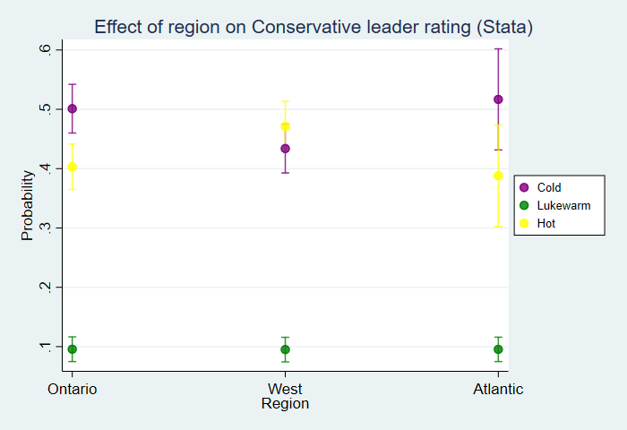
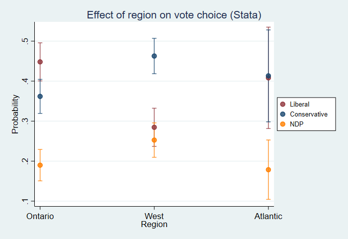

```{r, echo = FALSE}
knitr::opts_chunk$set(
  echo = TRUE,
  message = FALSE, 
  warning = FALSE,
  collapse = TRUE,
  comment = "#>",
  fig.path = "man/figures/"
)
```

```{r, echo = FALSE}
library(tidyverse)
library(ggplot2)
```


## Introduction

An oft-cited reason why `R` is not more widely used in social science research is its disjointed and incomplete set of tools to deal with weights. `{svyEffects}` helps address this problem by providing a suite of post-estimation tools for working with limited dependent variable models (binary, ordinal, and multinomial logit) estimated on survey-weighted data.

Its main set of functions calculate predicted probabilities using either:

- the *average marginal effects* approach (also known as *marginal effects at observed values*, or *adjusted predictions*); or 
- the *marginal effects at reasonable/representative/typical values* approach (also known as *marginal effects for the average case*). 

These approaches are analogous to Stata's commands `margins x` and `margins x, at`, respectively.

After calculating predicted probabilities, it will then calculate differences in probabilities (also known as *contrasts*/*pairwise comparisons* for categorical predictors or *first differences* for continuous predictors) using:

- for continuous predictors, the change across the entire range of the variable (by default), or a one-unit or one-standard-deviation change centred on the mean; or
- for categorical predictors, all pairwise differences.

For both predictions and differences, it uses simulation methods (the parametric bootstrap) to derive 95% confidence intervals.

It works with the following survey-weighted model objects: `survey::svyglm` (binary logit), `survey::svyolr` (ordered logit), `svrepmisc::svymultinom` (multinomial logit)

Eventually, support for (non-survey) weighted model objects (i.e. models estimated with the `weight` option) will be added for `glm`, `MASS::polr`, and `nnet::multinom`.

Also included in the package are:
 
- A snippet of the 2019 Canadian Election Study online survey for testing and demonstration purposes. This can be loaded with the command `data(ces19)`.
- A `plot()` method that creates a `ggplot` object of predicted probabilities or differences in predicted probabilities. This plot can be modified by adding further `ggplot` commands, which is shown below.
- A function `mnlSig` that displays a concise summary of multinomial logit coefficients with statistical significance stars. This has been adapted for use on `svymultinom` objects from Dave Armstrong's original function from `{DAMisc}`, which works for `multinom` objects.


--------------------------------------------------------------------------------


# Development history and differences from other packages

This package extends functions originally written by Dave Armstrong, some of which are in his `{DAMisc}` package (https://github.com/davidaarmstrong/damisc). 

The reporting functions and naming conventions are inspired by Daniel Ludecke's excellent `{ggeffects}` package (https://github.com/strengejacke/ggeffects). Current users of `{ggeffects}` will notice similarities between `{svyEffects}` and `{ggeffects}`. However, while `{ggeffects}` can estimate MER probabilities (what it calls *adjusted predictions*) with `svyglm` objects, it is not compatible with either `svyolr` or `svymultinom` objects. Moreover, `{svyEffects}` estimates true average marginal effects, which is the estimate of a variable's effect on a given outcome at the population level as opposed to a variable's effect for a hypothetical "average case" that may or may not exist or even be theoretically plausible. (A detailed discussion of the difference is in Hanmer and Kalkan 2013, *AJPS*, the full citation of which can be found in the reference section.) 

Note: because AMEs run simulations on multiple copies of your dataset, they can take much more time to calculate than MERs, particularly on large datasets or when using an older computer. Those needing quick results can calculate MERs (which, in practice *usually* substantively similar to AMEs) and then decide from there for which variables they want to calculate AMEs. 


--------------------------------------------------------------------------------


# Binary dependent variable models

To demonstrate how this function works with binary dependent variables, we'll model voting for the Conservative Party of Canada versus voting for any other party.

```{r}
data(ces19)

library(survey)
ces19_svy <- survey::svydesign(ids = ~1, strata = NULL, weights = ~pesweight, 
                                data = ces19, digits = 3)

VOTECON <- survey::svyglm(votecon ~ agegrp + gender + educ + region + relig + marketlib + culturetrad, 
                          design = ces19_svy, family = binomial)
summary(VOTECON)
```

The estimates from `survey::svyglm` closely resemble the ones from `Stata`'s `ologit` command with `[pweight=]` specified.

```
. logit votecon i.agegrp i.gender i.educ i.region i.relig marketlib culturetrad [pweight=pesweight]

Iteration 0:   log pseudolikelihood = -748.14844  
Iteration 1:   log pseudolikelihood = -527.72183  
Iteration 2:   log pseudolikelihood = -521.12786  
Iteration 3:   log pseudolikelihood =  -521.0995  
Iteration 4:   log pseudolikelihood =  -521.0995  

Logistic regression                             Number of obs     =      1,284
                                                Wald chi2(12)     =     233.71
                                                Prob > chi2       =     0.0000
Log pseudolikelihood =  -521.0995               Pseudo R2         =     0.3035

-----------------------------------------------------------------------------------------
                        |               Robust
                votecon |      Coef.   Std. Err.      z    P>|z|     [95% Conf. Interval]
------------------------+----------------------------------------------------------------
                 agegrp |
                 35-54  |    .189691   .3066531     0.62   0.536    -.4113379      .79072
                   55+  |   .3757134   .3022457     1.24   0.214    -.2166774    .9681042
                        |
                 gender |
           Woman/Other  |  -.3595359    .187009    -1.92   0.055    -.7260668    .0069949
                        |
                   educ |
              Some PSE  |   .0288547   .2444425     0.12   0.906    -.4502439    .5079532
            Uni degree  |   .0815175   .2696145     0.30   0.762    -.4469172    .6099521
                        |
                 region |
                  West  |   .6462519   .1960296     3.30   0.001     .2620408    1.030463
              Atlantic  |    .328965   .3562407     0.92   0.356    -.3692538    1.027184
                        |
                  relig |
              Catholic  |   .4525211   .2619628     1.73   0.084    -.0609167    .9659588
Non-Catholic Christian  |     .65283   .2296122     2.84   0.004     .2027984    1.102862
                 Other  |   .7505504   .3960992     1.89   0.058    -.0257897    1.526891
                        |
              marketlib |   2.285789   .3026759     7.55   0.000     1.692555    2.879023
            culturetrad |   1.961341   .2384488     8.23   0.000      1.49399    2.428692
                  _cons |  -.7241952   .4295126    -1.69   0.092    -1.566024    .1176339
-----------------------------------------------------------------------------------------
```

Let's look at the effect of educational attainment (`educ`), a categorical predictor with three levels: high school or less, some post-secondary, and a university degree at the bachelor's level or higher.

The function `svyAME` will return average marginal effects for education, or the effect of a change in education, holding all other variables at observed values. We'll specify a seed value for reproducibility purposes.

The function's output is a list that contains three data frames: 

- `$preds`: predicted probabilities
- `$diffs`: differences in predicted probabilities
- `$seed`: the seed value used for the simulations

```{r}
library(svyEffects)
VOTECON_educ_ame <- svyEffects::svyAME(VOTECON,
                                       varname = "educ",
                                       weightvar = "pesweight",
                                       seed = 2019)
VOTECON_educ_ame$preds
```

The results from the equivalent `Stata` command are below. We can see the results produced by `sveAME` are within 0.001 for the mean predicted probability and within 0.002 for the upper and lower 95% confidence bounds. 


```
. margins educ, post

Predictive margins                              Number of obs     =      1,284
Model VCE    : Robust

Expression   : Pr(votecon), predict()

------------------------------------------------------------------------------
             |            Delta-method
             |     Margin   Std. Err.      z    P>|z|     [95% Conf. Interval]
-------------+----------------------------------------------------------------
        educ |
 HS or less  |   .4028122    .032937    12.23   0.000      .338257    .4673675
   Some PSE  |   .4072815   .0198093    20.56   0.000     .3684559     .446107
 Uni degree  |   .4154583   .0218131    19.05   0.000     .3727054    .4582112
------------------------------------------------------------------------------
```

`svyAME` also calculates the differences in predicted probabilities for all pairwise comparisons between levels of our predictor variable. 

```{r}
VOTECON_educ_ame$diffs
```

These differences also compare favourably to the same results from `Stata`. The `svyEffects` and `Stata` results differ by <0.001.


```
. lincom _b[2.educ] - _b[1.educ]

 ( 1)  - 1bn.educ + 2.educ = 0

------------------------------------------------------------------------------
             |      Coef.   Std. Err.      z    P>|z|     [95% Conf. Interval]
-------------+----------------------------------------------------------------
         (1) |   .0044692   .0378337     0.12   0.906    -.0696834    .0786218
------------------------------------------------------------------------------

. lincom _b[3.educ] - _b[1.educ]

 ( 1)  - 1bn.educ + 3.educ = 0

------------------------------------------------------------------------------
             |      Coef.   Std. Err.      z    P>|z|     [95% Conf. Interval]
-------------+----------------------------------------------------------------
         (1) |   .0126461   .0417288     0.30   0.762    -.0691408     .094433
------------------------------------------------------------------------------

. lincom _b[3.educ] - _b[2.educ]

 ( 1)  - 2.educ + 3.educ = 0

------------------------------------------------------------------------------
             |      Coef.   Std. Err.      z    P>|z|     [95% Conf. Interval]
-------------+----------------------------------------------------------------
         (1) |   .0081769   .0302207     0.27   0.787    -.0510547    .0674084
------------------------------------------------------------------------------
```

The outputs of this function lend themselves well to plotting using `{ggplot2}`. As an example, let's plot the predicted probabilities of voting Conservative across levels of education.

```{r}
library(ggplot2)
ggplot(VOTECON_educ_ame$preds) +
  aes(x = educ,
      y = predicted,
      ymin = conf.low,
      ymax = conf.high) +
  geom_pointrange() +
  labs(title = "Probability of voting Conservative by education",
       y = "Predicted probability",
       x = "Education")
```

For convenience, `{svyEffects}` also includes a `plot()` method, which uses the `{ggplot2}` engine to visualize either predicted probabilities or differences in predicted probabilities.

By default, the predicted probabilities are plotted, as shown below. 

```{r}
plot(VOTECON_educ_ame)
```

Note that labelling is minimal on the automatically-generated plots, but you can add your own customization using `{ggplot2}`'s code conventions.

```{r}
plot(VOTECON_educ_ame) +
  scale_y_continuous(labels = scales::percent) +
  labs(title = "My title",
       subtitle = "My subtitle",
       x = "My xvar label",
       y = "My yvar label",
       caption = "My caption") +
  theme_classic()
```

You can also plot the differences in predicted probabilities between levels of education by including the option `what = "diffs"` (or simply `"diffs"`) in the `plot()` function call.

Note, to do this in `Stata`, you would have to calculate each pairwise difference with a separate command. While it is not difficult to write a loop to do that, you would still need to output the results to a separate matrix and then generate the plot. The functions in `svyEffects` do that for you.


```{r}
plot(VOTECON_educ_ame, "diffs") +
  geom_hline(yintercept = 0, linetype = "dotted")
```

Now, let's look at the effect of market liberalism, a continuous predictor that ranges from -1 (minimal market liberalism, or the most left-wing position) to +1 (maximal market liberalism, or the most right-wing position).


```{r}
VOTECON_marketlib_ame <- svyAME(VOTECON,
                                varname = "marketlib",
                                weightvar = "pesweight",
                                seed = 2019)
VOTECON_marketlib_ame$preds
```

`svyAME` also produces very similar results to `Stata` for the effect of market liberalism. The probabilities differ a bit more at the ends of the range (up to 0.006), but at the median of the predictor, the results are within 0.001.


```
. margins, at(marketlib=(-1(.2)1)) post

Predictive margins                              Number of obs     =      1,284
Model VCE    : Robust

Expression   : Pr(votecon), predict()

1._at        : marketlib       =          -1

2._at        : marketlib       =         -.8

3._at        : marketlib       =         -.6

4._at        : marketlib       =         -.4

5._at        : marketlib       =         -.2

6._at        : marketlib       =           0

7._at        : marketlib       =          .2

8._at        : marketlib       =          .4

9._at        : marketlib       =          .6

10._at       : marketlib       =          .8

11._at       : marketlib       =           1

------------------------------------------------------------------------------
             |            Delta-method
             |     Margin   Std. Err.      z    P>|z|     [95% Conf. Interval]
-------------+----------------------------------------------------------------
         _at |
          1  |   .1181695   .0276963     4.27   0.000     .0638859    .1724532
          2  |   .1662161   .0284543     5.84   0.000     .1104467    .2219855
          3  |   .2264479   .0262596     8.62   0.000     .1749801    .2779157
          4  |   .2980519   .0215145    13.85   0.000     .2558844    .3402195
          5  |   .3786382   .0172419    21.96   0.000     .3448446    .4124317
          6  |    .464545   .0192988    24.07   0.000     .4267201      .50237
          7  |   .5514882   .0272903    20.21   0.000     .4980002    .6049763
          8  |    .635286   .0359907    17.65   0.000     .5647454    .7058265
          9  |    .712409   .0424183    16.79   0.000     .6292706    .7955475
         10  |   .7802779   .0453287    17.21   0.000     .6914353    .8691204
         11  |   .8373832   .0445384    18.80   0.000     .7500895     .924677
------------------------------------------------------------------------------
```

```{r}
VOTECON_marketlib_ame$diffs
plot(VOTECON_marketlib_ame)
```


Note that, because the function returns a first difference for continuous predictors, the graph is not any more illuminating than the summary statistic.

```{r, fig.height=3}
plot(VOTECON_marketlib_ame, "diffs")
```


--------------------------------------------------------------------------------


# Ordinal dependent variable models

To demonstrate ordinal dependent variables, we'll model feeling thermometer ratings for the leader of the Conservative Party of Canada. This variable usually ranges from 0 to 100. But, for this example, we'll used a collapsed ordinal measure of "cold" (0-39), "lukewarm" (40-59), and "hot" (60-100). 

```{r}
data(ces19)

library(survey)
ces19_svy <- svydesign(ids = ~1, strata = NULL, weights = ~pesweight, 
                        data = ces19, digits = 3)

CONLDR <- svyolr(ftconldr ~ agegrp + gender + educ + region + relig + marketlib + culturetrad, 
                 design = ces19_svy)
summary(CONLDR)
```

Here's the effect of education on feelings towards the Conservative Party leader. 

For brevity, only the visualizations of the predicted probabilities/differences are presented (along with comparisons versus `Stata`).

```{r}
CONLDR_region_ame <- svyAME(CONLDR,
                            varname = "region",
                            weightvar = "pesweight",
                            seed = 2019)
plot(CONLDR_region_ame)
```


For ordinal and multinomial probabilities, the plot method follows the conventions used by the `{ggeffects}` package (i.e. facetting by response level). But, you can re-create the `Stata` default of colour-coding the response level by writing your own `ggplot` command, as shown below.

```{r}
ggplot(CONLDR_region_ame$preds) + 
  aes(x = region, y = predicted, ymin = conf.low, ymax = conf.high, colour = y) +
  geom_pointrange(position = position_dodge2(.35)) +
  scale_y_continuous(limits = c(.05,.62)) +
  scale_colour_viridis_d() +
  labs(title = "Effect of region on Conservative leader rating (svyEffects)",
       x = "Region",
       y = "Predicted probability",
       colour = "Conservative \nleader rating") +
  theme_bw()
```

The predicted probabilities for region are very similar to the Stata results.




```{r}
plot(CONLDR_region_ame, "diffs") +
  geom_hline(yintercept = 0, linetype = "dotted")
```

Here's the effect of market liberalism.

```{r}
CONLDR_marketlib_ame <- svyAME(CONLDR,
                            varname = "marketlib",
                            weightvar = "pesweight",
                            diffchange = "range",
                            seed = 2019)
plot(CONLDR_marketlib_ame)
```


```{r, fig.height=3}
plot(CONLDR_marketlib_ame, "diffs")
```

The graph below shows the results similar to how `Stata` plots them. 

```{r}
ggplot(CONLDR_marketlib_ame$preds) +
  aes(x = marketlib, y = predicted, ymin = conf.low, ymax = conf.high, colour = y, fill = y) +
  geom_line() +
  geom_ribbon(colour = "transparent", alpha = 0.2) +
  scale_y_continuous(limits = c(0,1), breaks = seq(0, 1, length = 6)) +
  scale_x_continuous(breaks = seq(-1, 1, length = 6)) +
  scale_colour_viridis_d() +
  scale_fill_viridis_d() +
  labs(title = "Effect of market liberalism on Conservative leader ratings (svyEffects)",
       x = "Market liberalism (least to most)",
       y = "Predicted probability",
       fill = "Conservative \nleader rating",
       colour = "Conservative \nleader rating") +
  theme_bw()
```

The `Stata` results are very similar.


--------------------------------------------------------------------------------


# Multinomial dependent variable models

To demonstrate multinomial dependent variables, we'll model vote choice in the 2019 Canadian Federal Election. To keep things simple, we'll limit our analysis to the three major parties (the Liberals, Conservatives, and New Democrats) and exclude the province of Quebec (which has a different party system and patterns of vote choice).

There is no way to directly estimate a multinomial model with the `{survey}` package in R. The package `{svyrepmisc}` generates an approximation by turning the weighting scheme into replicate weights and estimating the model with those. It uses the jackknife to calculate variances.

We'll go through this process step-by-step. First, we'll import the data, do some data cleaning, and then create our usual survey-design object.

```{r}
data(ces19)
library(survey)
ces19_svy <- svydesign(ids = ~1, strata = NULL, weights = ~pesweight, 
                        data = ces19, digits = 3)
```

Now, we'll use the function `as.svrepdesign()` from `{survey}` to turn our sampling weights into replicate weights with variances calculated using the jackknife.

```{r}
ces19_svy_r <- as.svrepdesign(ces19_svy, type = "JK1")
```


After our survey design object with replicate weights and jackknife variances is created, we can use the function `svymultinom` from `{svyrepmisc}` to run our vote choice model. 

Note: use the option `trace = FALSE` in the `svymultinom()` function call to suppress the reporting of each replication (similar to using the option `quietly` in Stata).

Included with `{svyEffects}` the function `mnlSig`, which displays coefficients from multinomial logit models and flags statistically significant ones. `mnlSig` is adapted from Dave Armstrong's original function from his `{DAMisc}` package.


```{r}
# remotes::install_github("carlganz/svrepmisc")
library(svrepmisc)

VOTE <- svymultinom(vote ~ agegrp + gender + educ + region + relig + marketlib + culturetrad, 
                    design = ces19_svy_r, trace = FALSE)
mnlSig(VOTE)
```

For our post-estimation command, we'll need to specify a few more options because `svymultinom` does not store them in its output. These are:

- `design`: the survey design object used to estimate the model; and
- `modform`: the model formula used in the `svymultinom` call (in the form `modform = "y ~ x1 + x2 + x3"`).

Here's the effect of education.

```{r}
VOTE_region_ame <- svyAME(
  VOTE,
  varname = "region",
  weightvar = "pesweight",
  seed = 2019,
  design = ces19_svy_r,
  modform = "vote ~ agegrp + gender + educ + region + relig + marketlib + culturetrad")
VOTE_region_ame$preds
```


```{r}
plot(VOTE_region_ame)
```

The predicted probabilities by region in `Stata` format: 
```{r}
ggplot(VOTE_region_ame$preds) +
  aes(x = region, y = predicted, ymin = conf.low, ymax = conf.high, colour = y) +
  geom_pointrange(position = position_dodge2(.2)) +
  scale_y_continuous(limits = c(.1,.55), breaks = c(.1,.2,.3,.4,.5)) +
  scale_colour_manual(values =  c("maroon", "navy", "orange")) +
  labs(title = "Effect of region on vote choice (svyEffects)",
       x = "Region",
       y = "Predicted probability",
       colour = "Vote choice") +
  theme_bw()
```

And here are the results from `Stata`:



```{r}
plot(VOTE_region_ame, "diffs") +
  geom_hline(yintercept = 0, linetype = "dotted")
```

Here's the effect of market liberalism.

```{r}
VOTE_marketlib_ame <- svyAME(
  VOTE,
  varname = "marketlib",
  weightvar = "pesweight",
  seed = 2019,
  diffchange = "range",
  design = ces19_svy_r,
  modform = "vote ~ agegrp + gender + educ + region + relig + marketlib + culturetrad")
VOTE_marketlib_ame$preds
plot(VOTE_marketlib_ame)
```

The effect of market liberalism graphed in "`Stata` format":

```{r}
ggplot(VOTE_marketlib_ame$preds) +
  aes(x = marketlib, y = predicted, ymin = conf.low, ymax = conf.high, colour = y, fill = y) +
  geom_line() +
  geom_ribbon(colour = "transparent", alpha = 0.2) +
  scale_y_continuous(limits = c(0,1), breaks = seq(0, 1, length = 6)) +
  scale_x_continuous(breaks = seq(-1, 1, length = 6)) +
  scale_colour_manual(values = c("maroon", "navy", "orange")) +
  scale_fill_manual(values = c("maroon", "navy", "orange")) +
  labs(title = "Effect of market liberalism on vote choice (svyEffects)",
       x = "Market liberalism (least to most)",
       y = "Predicted probability",
       fill = "Vote choice",
       colour = "Vote choice") +
  theme_bw()
```

Here are the results from `Stata`:


Finally, are the differences:

```{r, fig.height=3}
plot(VOTE_marketlib_ame, "diffs")
```


--------------------------------------------------------------------------------


# Marginal effects at reasonable values
*(documentation in progress)*

You can choose to calculate marginal effects at reasonable values (MER) 
probabilities and differences by using the `svyMER` function, which follows the 
same arguments as `svyAME`. This command would give you the estimated effect of 
a variable "for the 'typical' case" (which may or may not be typical, plausible, 
or even possible in the real world) as opposed to the effect of a variable across 
the population (see Hanmer and Kalkan 2013 for an in-depth discussion). 

MER probabilities are *usually* very similar to AME probabilities, but not 
always. However, they are *much* faster to calculate using simulation methods.


--------------------------------------------------------------------------------


# Interaction effects
*(documentation in progress)*

Both `svyAME` and `svyMER` support calculating predicted probabilities of 
combinations of two predictor variables. This can be done by using the argument 
`byvar = "x"` in the function call.

This will not return differences in predicted probabilities. For limited-dependent 
variable models, one would need to calculate a second difference would be needed 
to test for the significance of an interaction between two variables, either from 
the inclusion of a product term or through the compression inherent in these 
types of models (see Norton, Wang, and Ai 2004).

Dave Armstrong's `{DAMisc}` package has an `R` port for Norton, Wang, and Ai's 
original `Stata` function, and this will eventually be ported to `{svyEffects}` 
for use in survey-weighted models.


--------------------------------------------------------------------------------


# Planned updates

This package is under active development, and updates will include:

1. More user-friendly error-checking and reporting (e.g. checking at the 
beginning of the function that the variables in the function don't have typos).
2. Support for (non-survey) weighted models and weighted models. While there 
are other packages that do this, some do not return confidence intervals for 
predictions for some model types. And, to my knowledge, none use simulation 
methods to derive confidence intervals. *Note: You can actually already do this 
with `{svyEffects}` by creating a survey design object with a weight of "1", but 
it would be good to avoid having to use that workaround.*
3. In-depth comparisons with Stata results.
4. Functions for calculating weighted model fit measures.
54. Support for using an alternative variance-covariance matrix using `{sandwich}`. 
This would only be for binary logit models because `{sandwich}` does not play nice 
with ordinal or multinomial models. That said, survey-weighted models do adjust 
the variance-covariance matrix (the documentation for `{survey}` does not 
specify the correction method it uses, but it appears to be HC0, based on what 
I've seen). 
6. A second differences function to test for the significance of a two-way 
interaction.
7. (Eventually) Use of the delta method to calculate confidence intervals for 
AMEs  probabilities to speed up computational time.


--------------------------------------------------------------------------------


# References

Armstrong, Dave. 2022. _DAMisc: Dave Armstrong's Miscellaneous Functions._ 
R package version 1.7.2. 

Hanmer, M.J. and K.O. Kalkan.  2013. "Behind the Curve: Clarifying the Best 
Approach to Calculating Predicted Probabilities and Marginal Effects from Limited 
Dependent Variable Models." _American Journal of Political Science_. 57(1): 263-277.

Norton, Edward C., Hua Wang and Chunrong Ai. 2004. Computing Interaction Effects 
and Standard Errors in Logit and Probit Models. _The Stata Journal_ 4(2): 154-167.

Rainey, Carlisle. 2016. "Compression and Conditional Effects: A Product Term Is 
Essential When Using Logistic Regression to Test for Interaction." 
_Political Science Research and Methods_ 4(3): 621-639.

Stephenson, Laura B; Harell, Allison; Rubenson, Daniel; Loewen, Peter John, 2020, 
"2019 Canadian Election Study - Online Survey," https://doi.org/10.7910/DVN/DUS88V, 
Harvard Dataverse, V1.


