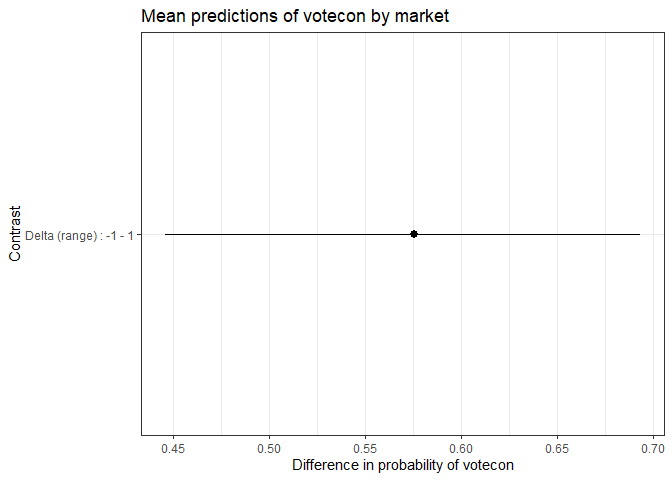
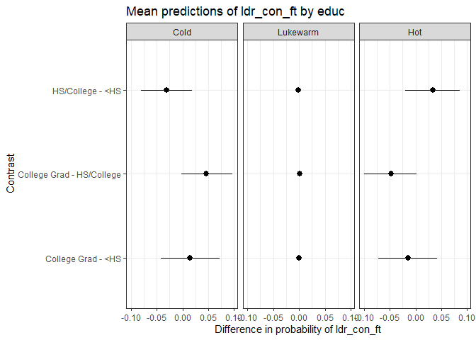
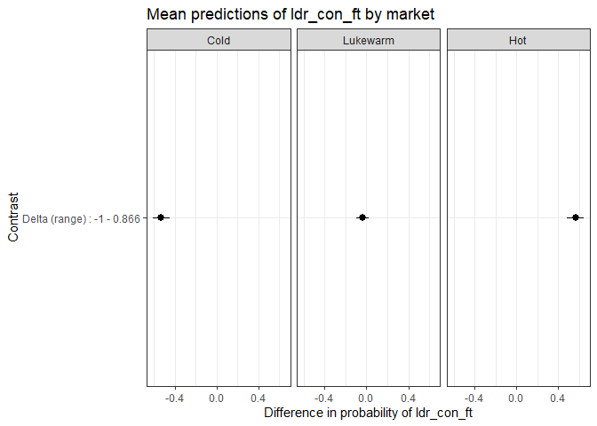
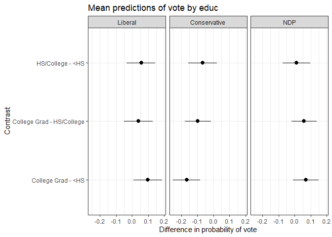
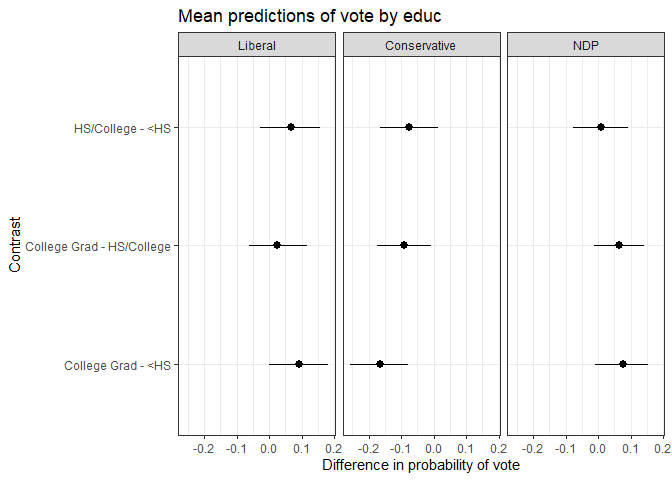

svyEffects
================

## Introduction

An oft-cited reason why `R` is not more widely used in social science
research is its disjointed and incomplete set of tools to deal with
weighted survey data. `svyEffects` address helps address this problem by
providing a suite of post-estimation tool for working with limited
dependent variable models (binary, ordinal, and multinomial logit)
estimated on survey-weighted data.

It’s main set of functions calculate predicted probabilities using
either:

-   the *average marginal effects* approach (also known as *marginal
    effects at observed values*, or *adjusted predictions*); or
-   the *marginal effects at reasonable/representative/typical values*
    approach (also known as *marginal effects for the average case*).

These approaches are analogous to Stata’s commands `margins x` and
`margins x, at`, respectively.

After calculating predicted probabilities, it will then calculate
differences in probabilities (also known as *contrasts*/*pairwise
comparisons* for categorical predictors or *first differences* for
continuous predictors) using:

-   for continuous predictors, either the change across the entire range
    of the variable (by default), or a one-unit or
    one-standard-deviation change centred on the mean; or
-   for categorical predictors, all pairwise differences.

For both predictions and differences, it uses simulation methods (the
parametric bootstrap) to derive 95% confidence intervals.

It works with the following survey-weighted models or (non-survey)
weighted models (i.e. models estimated with the `weight=` option
enabled):

-   Binary logit models
    -   `survey::svyglm`
    -   `glm`
-   Ordinal logit models
    -   `MASS::polr`
    -   `survey::svyolr`
-   Multinomial logit models
    -   `svrepmisc::svymultinom`
    -   `nnet::multinom`

A snippet of the 2019 Canadian Election Study online panel sample is
included with the package for testing and demonstration purposes.

# Development history and differences from other packages

This package extends functions originally written by Dave Armstrong in
his `DAMisc` package (<https://github.com/davidaarmstrong/damisc>).

The reporting functions and naming conventions are inspired by Daniel
Ludecke’s excellent `ggeffects` package
(<https://github.com/strengejacke/ggeffects>), and current users of
`ggeffects` will notice similarities between `svyEffects` and
`ggeffects`. However, while `ggeffects` can estimate MER probabilities
(what it calls *adjusted predictions*) with `svyglm` objects, it is not
compatible with either `svyolr` or `svymultinom` objects. Moreover,
`svyEffects` estimates true average marginal effects, which is the
estimate of a variable’s effect on a given outcome at the population
level as opposed to a variable’s effect for a hypothetical “average
case” that may or may not exist or even be theoretically plausible. (A
detailed discussion of the difference is in Hanmer and Kalkan 2013,
*AJPS*, the full citation of which can be found in the reference section
at the end of this readme.)

# Binary dependent variable models

To demonstrate how this function works with binary dependent variables,
we’ll model voting for the Conservative Party of Canada versus voting
for any other party.

``` r
data(ces19w)
ces19w <- ces19w %>% na.omit()

library(survey)
ces19w_svy <- survey::svydesign(ids = ~1, strata = NULL, weights = ~sampleweight, 
                                data = ces19w, digits = 3)

VOTECON <- survey::svyglm(votecon ~ agegrp + educ + region + market, 
                          design = ces19w_svy, family = binomial)
summary(VOTECON)
#> 
#> Call:
#> svyglm(formula = votecon ~ agegrp + educ + region + market, design = ces19w_svy, 
#>     family = binomial)
#> 
#> Survey design:
#> survey::svydesign(ids = ~1, strata = NULL, weights = ~sampleweight, 
#>     data = ces19w, digits = 3)
#> 
#> Coefficients:
#>                  Estimate Std. Error t value Pr(>|t|)    
#> (Intercept)      -0.13112    0.24032  -0.546 0.585433    
#> agegrp35-54       0.34556    0.20406   1.693 0.090638 .  
#> agegrp55+         0.05066    0.21332   0.237 0.812322    
#> educHS/College   -0.40425    0.18120  -2.231 0.025872 *  
#> educCollege Grad -0.90059    0.18450  -4.881 1.20e-06 ***
#> regionAtlantic   -0.03208    0.29919  -0.107 0.914643    
#> regionWest        0.51705    0.17295   2.990 0.002852 ** 
#> regionQuebec     -0.67727    0.19823  -3.417 0.000656 ***
#> market            1.90957    0.23581   8.098 1.39e-15 ***
#> ---
#> Signif. codes:  0 '***' 0.001 '**' 0.01 '*' 0.05 '.' 0.1 ' ' 1
#> 
#> (Dispersion parameter for binomial family taken to be 0.9935463)
#> 
#> Number of Fisher Scoring iterations: 4
```

Let’s look at the effect of educational attainment (`educ`), a
categorical predictor with three levels: high school or less, some
post-secondary, and a university degree at the bachelor’s level or
higher.

The function `svyAME` will return average marginal effects for
education, or the effect of a change in education, holding all other
variables at observed values. We’ll specify a seed value for
reproducibility purposes.

The function’s output is a list that contains three data frames:

-   `$preds`: predicted probabilities
-   `$diffs`: differences in predicted probabilities
-   `$seed`: the seed value used for the simulations

``` r
library(svyEffects)
VOTECON_educ_ame <- svyEffects::svyAME(VOTECON,
                                       varname = "educ",
                                       weightvar = "sampleweight",
                                       seed = 2019)
VOTECON_educ_ame$preds
#> # A tibble: 3 x 5
#>   educ         predicted conf.low conf.high type                 
#>   <fct>            <dbl>    <dbl>     <dbl> <chr>                
#> 1 <HS              0.444    0.390     0.495 Predicted probability
#> 2 HS/College       0.362    0.316     0.409 Predicted probability
#> 3 College Grad     0.270    0.230     0.313 Predicted probability
VOTECON_educ_ame$diffs
#> # A tibble: 3 x 5
#>   educ                      predicted conf.low conf.high type      
#>   <chr>                         <dbl>    <dbl>     <dbl> <chr>     
#> 1 HS/College - <HS            -0.0823   -0.152   -0.0101 Difference
#> 2 College Grad - <HS          -0.174    -0.243   -0.104  Difference
#> 3 College Grad - HS/College   -0.0918   -0.153   -0.0285 Difference
VOTECON_educ_ame$seed
#> [1] 2019
```

The outputs of this function lend themselves well to plotting using
`ggplot2`. As an example, let’s plot the predicted probabilities of
voting Conservative across changes in education.

``` r
library(ggplot2)
ggplot(VOTECON_educ_ame$preds) +
  aes(x = educ,
      y = predicted,
      ymin = conf.low,
      ymax = conf.high) +
  geom_pointrange() +
  labs(title = "Probability of voting Conservative by education",
       y = "Predicted probability",
       x = "Education")
```

<!-- -->

For convenience, `svyEffects` also includes a `plot()` method, which
uses the `ggplot2` engine to visualize either predicted probabilities or
differences in predicted probabilities.

By default, the predicted probabilities are plotted, as shown below.

``` r
plot(VOTECON_educ_ame)
```

<!-- -->

Note that labelling is minimal on the automatically-generated plots, but
you can add your own customization using `ggplot2`’s code conventions.

``` r
plot(VOTECON_educ_ame) +
  scale_y_continuous(labels = scales::percent) +
  labs(title = "My title",
       subtitle = "My subtitle",
       x = "My xvar label",
       y = "My yvar label",
       caption = "My caption") +
  theme_classic()
```

<!-- -->

You can also plot the differences in predicted probabilities by
including the option `what = "diffs"` (or simply `"diffs"`) in the
`plot()` function call.

``` r
plot(VOTECON_educ_ame, "diffs")
```

<!-- -->

Now, let’s look at the effect of market liberalism, continuous predictor
that ranges from -1 (minimal market liberalism, or the most left
position) to +1 (maximal market liberalism, or the most right position).

Note that, because the function returns a first difference for
continuous predictors, the graph is not any more illuminating than the
summary statistic.

``` r
VOTECON_market_ame <- svyAME(VOTECON,
                             varname = "market",
                             weightvar = "sampleweight",
                             seed = 2019)
VOTECON_market_ame$preds
#> # A tibble: 11 x 5
#>     market predicted conf.low conf.high type       
#>      <dbl>     <dbl>    <dbl>     <dbl> <chr>      
#>  1 -1         0.0984   0.0646     0.140 Probability
#>  2 -0.813     0.134    0.0981     0.180 Probability
#>  3 -0.627     0.177    0.139      0.216 Probability
#>  4 -0.440     0.231    0.195      0.268 Probability
#>  5 -0.254     0.295    0.264      0.328 Probability
#>  6 -0.0670    0.367    0.339      0.398 Probability
#>  7  0.120     0.445    0.407      0.487 Probability
#>  8  0.306     0.525    0.474      0.578 Probability
#>  9  0.493     0.606    0.540      0.674 Probability
#> 10  0.679     0.680    0.600      0.750 Probability
#> 11  0.866     0.748    0.662      0.820 Probability
VOTECON_market_ame$diffs
#> # A tibble: 1 x 5
#>   market                     predicted conf.low conf.high type      
#>   <chr>                          <dbl>    <dbl>     <dbl> <chr>     
#> 1 Delta (range) : -1 - 0.866     0.646    0.521     0.752 Difference
VOTECON_market_ame$seed
#> [1] 2019
plot(VOTECON_market_ame)
```

<!-- -->

``` r
plot(VOTECON_market_ame, "diffs")
```

<!-- -->

# Ordinal dependent variable models

To demonstrate ordinal dependent variables, we’ll model feeling
thermometer ratings for the leader of the Conservative Party of Canada,
which usually ranges from 0 to 100, but, for this example, is collapsed
into an ordinal measure of “cold” (0-39), “lukewarm” (40-59), and “hot”
(60-100).

``` r
data(ces19w)
ces19w <- ces19w %>% na.omit()

library(survey)
ces19w_svy <- svydesign(ids = ~1, strata = NULL, weights = ~sampleweight, 
                        data = ces19w, digits = 3)

CONLDR <- svyolr(ldr_con_ft ~ agegrp + educ + region + market, 
                 design = ces19w_svy)
summary(CONLDR)
#> Call:
#> svyolr(ldr_con_ft ~ agegrp + educ + region + market, design = ces19w_svy)
#> 
#> Coefficients:
#>                        Value Std. Error    t value
#> agegrp35-54       0.26139017  0.1726129  1.5143141
#> agegrp55+        -0.07502762  0.1798174 -0.4172433
#> educHS/College    0.03891462  0.1581898  0.2459995
#> educCollege Grad -0.26882201  0.1531547 -1.7552316
#> regionAtlantic    0.04536588  0.2725621  0.1664424
#> regionWest        0.29899766  0.1625346  1.8395937
#> regionQuebec      0.35465699  0.1509735  2.3491336
#> market            1.66543463  0.1954164  8.5224925
#> 
#> Intercepts:
#>               Value   Std. Error t value
#> Cold|Lukewarm -0.9002  0.2223    -4.0494
#> Lukewarm|Hot   0.6398  0.2246     2.8490
```

Here’s the effect of education on feelings towards the Conservative
Party leader.

``` r
CONLDR_educ_ame <- svyEffects::svyAME(CONLDR,
                                      varname = "educ",
                                      weightvar = "sampleweight",
                                      seed = 2019)
CONLDR_educ_ame
#> $preds
#> # A tibble: 9 x 6
#>   y        educ         predicted conf.low conf.high type       
#>   <fct>    <fct>            <dbl>    <dbl>     <dbl> <chr>      
#> 1 Cold     <HS              0.294    0.247     0.343 Probability
#> 2 Lukewarm <HS              0.337    0.308     0.367 Probability
#> 3 Hot      <HS              0.369    0.320     0.421 Probability
#> 4 Cold     HS/College       0.286    0.246     0.329 Probability
#> 5 Lukewarm HS/College       0.336    0.306     0.367 Probability
#> 6 Hot      HS/College       0.378    0.333     0.425 Probability
#> 7 Cold     College Grad     0.348    0.307     0.394 Probability
#> 8 Lukewarm College Grad     0.339    0.309     0.369 Probability
#> 9 Hot      College Grad     0.314    0.275     0.358 Probability
#> 
#> $diffs
#> # A tibble: 9 x 6
#>   y        educ                      predicted conf.low conf.high type      
#>   <fct>    <chr>                         <dbl>    <dbl>     <dbl> <chr>     
#> 1 Cold     HS/College - <HS          -0.00766  -0.0681    0.0517  Difference
#> 2 Lukewarm HS/College - <HS          -0.000718 -0.00894   0.00784 Difference
#> 3 Hot      HS/College - <HS           0.00838  -0.0590    0.0756  Difference
#> 4 Cold     College Grad - <HS         0.0541   -0.00789   0.115   Difference
#> 5 Lukewarm College Grad - <HS         0.00175  -0.00310   0.00962 Difference
#> 6 Hot      College Grad - <HS        -0.0558   -0.121     0.00766 Difference
#> 7 Cold     College Grad - HS/College  0.0617    0.00430   0.117   Difference
#> 8 Lukewarm College Grad - HS/College  0.00247  -0.00271   0.00992 Difference
#> 9 Hot      College Grad - HS/College -0.0642   -0.122    -0.00461 Difference
#> 
#> $seed
#> [1] 2019
#> 
#> attr(,"class")
#> [1] "svyEffects"
#> attr(,"predvar")
#> [1] "educ"
#> attr(,"depvar")
#> [1] "ldr_con_ft"
plot(CONLDR_educ_ame)
```

<!-- -->

``` r
plot(CONLDR_educ_ame, "diffs")
```

<!-- -->

And, here’s the effect of market liberalism.

``` r
CONLDR_market_ame <- svyAME(CONLDR,
                            varname = "market",
                            weightvar = "sampleweight",
                            diffchange = "range",
                            seed = 2019)
CONLDR_market_ame
#> $preds
#> # A tibble: 33 x 6
#>    y        market predicted conf.low conf.high type       
#>    <fct>     <dbl>     <dbl>    <dbl>     <dbl> <chr>      
#>  1 Cold     -1         0.635   0.552      0.711 Probability
#>  2 Lukewarm -1         0.252   0.204      0.300 Probability
#>  3 Hot      -1         0.113   0.0807     0.156 Probability
#>  4 Cold     -0.813     0.563   0.493      0.630 Probability
#>  5 Lukewarm -0.813     0.290   0.250      0.330 Probability
#>  6 Hot      -0.813     0.147   0.111      0.188 Probability
#>  7 Cold     -0.627     0.490   0.435      0.547 Probability
#>  8 Lukewarm -0.627     0.322   0.289      0.356 Probability
#>  9 Hot      -0.627     0.188   0.153      0.228 Probability
#> 10 Cold     -0.440     0.414   0.372      0.457 Probability
#> # ... with 23 more rows
#> 
#> $diffs
#> # A tibble: 3 x 6
#>   y        market                     predicted conf.low conf.high type      
#>   <fct>    <fct>                          <dbl>    <dbl>     <dbl> <chr>     
#> 1 Cold     Delta (range) : -1 - 0.866   -0.558    -0.641   -0.471  Difference
#> 2 Lukewarm Delta (range) : -1 - 0.866   -0.0534   -0.118    0.0134 Difference
#> 3 Hot      Delta (range) : -1 - 0.866    0.612     0.522    0.692  Difference
#> 
#> $seed
#> [1] 2019
#> 
#> attr(,"class")
#> [1] "svyEffects"
#> attr(,"predvar")
#> [1] "market"
#> attr(,"depvar")
#> [1] "ldr_con_ft"
plot(CONLDR_market_ame)
```

<!-- -->

``` r
plot(CONLDR_market_ame, "diffs")
```

<!-- -->

# Multinomial dependent variable models

To demonstrate multinomial dependent variables, we’ll model vote choice
in the 2019 Canadian Federal Election. To keep things simple, we’ll
limit our analysis to the three major parties (the Liberals,
Conservatives, and New Democrats) and exclude the province of Quebec
(which has a different party system and patterns of vote choice).

There is no way to directly estimate a multinomial model with the
package in R. The generates an approximation by turning the weighting
scheme into replicate weights and estimating the model with those. It
uses the jackknife to calculate variances.

We’ll go through this process step-by-step. First, we’ll import the
data, do some data cleaning, and then create our usual survey-design
object.

``` r
data(ces19w)
ces19w <- ces19w %>%
  filter(region != "Quebec") %>%
  filter(vote %in% c("Liberal", "Conservative", "NDP")) %>%
  mutate(region = droplevels(region),
         vote = droplevels(vote)) %>% 
  na.omit()

library(survey)
ces19w_svy <- svydesign(ids = ~1, strata = NULL, weights = ~sampleweight, 
                        data = ces19w, digits = 3)
```

Now, we’ll use the function `as.svrepdesign()` from to turn our sampling
weights into replicate weights with variances calculated using the
jackknife.

``` r
ces19w_svy_r <- as.svrepdesign(ces19w_svy, type="JK1")
```

After our survey design object with replicate weights and jackknife
variances is created, we can use the function `svymultinom()` from to
run our vote choice model.

Note: use the option `trace = FALSE` in the `svymultinom()` function
call to suppress the reporting of each replication (similar to using the
option `quietly` in Stata).

Included with the function `mnlSig`, which displays coefficients from
multinomial logit models and flags statistically significant ones.
`mnlSig` is adapted from Dave Armstrong’s original function from his
package.

``` r
# remotes::install_github("carlganz/svrepmisc")
library(svrepmisc)

VOTE <- svymultinom(vote ~ region + educ + relig + market, 
                    design = ces19w_svy_r, trace = FALSE)
mnlSig(VOTE)
#>                             Conservative     NDP
#> (Intercept)                       0.197  -0.496 
#> regionAtlantic                   -0.120   0.003 
#> regionWest                        0.983*  0.834*
#> educHS/College                   -0.398  -0.143 
#> educCollege Grad                 -0.823*  0.014 
#> religNon-Catholic Christian       0.704* -0.274 
#> religCatholic                     0.131  -0.505 
#> religOther                       -2.180* -2.679 
#> market                            1.769* -1.171*
```

For our post-estimation command, we’ll need to specify a few more
options because `svymultinom` does not store them in it’s output. These
are:

-   `design=`: the survey design object used to estimate the model; and
-   `modform`: the model formula used in the `svymultinom` call.

Here’s the effect of education.

``` r
VOTE_educ_ame <- svyAME(VOTE,
                        varname = "educ",
                        weightvar = "sampleweight",
                        seed = 2019,
                        design = ces19w_svy_r,
                        modform = "vote ~ region + educ + relig + market")
VOTE_educ_ame
#> $preds
#> # A tibble: 9 x 6
#>   y            educ         predicted conf.low conf.high type       
#>   <fct>        <fct>            <dbl>    <dbl>     <dbl> <chr>      
#> 1 Liberal      <HS              0.271    0.210     0.337 Probability
#> 2 Conservative <HS              0.515    0.449     0.584 Probability
#> 3 NDP          <HS              0.213    0.157     0.278 Probability
#> 4 Liberal      HS/College       0.328    0.268     0.392 Probability
#> 5 Conservative HS/College       0.448    0.388     0.503 Probability
#> 6 NDP          HS/College       0.224    0.171     0.281 Probability
#> 7 Liberal      College Grad     0.368    0.304     0.433 Probability
#> 8 Conservative College Grad     0.350    0.293     0.407 Probability
#> 9 NDP          College Grad     0.282    0.233     0.339 Probability
#> 
#> $diffs
#> # A tibble: 9 x 6
#>   y            educ                      predicted conf.low conf.high type      
#>   <fct>        <chr>                         <dbl>    <dbl>     <dbl> <chr>     
#> 1 Liberal      HS/College - <HS             0.0570 -0.0335     0.145  Difference
#> 2 Conservative HS/College - <HS            -0.0677 -0.156      0.0234 Difference
#> 3 NDP          HS/College - <HS             0.0107 -0.0733     0.0976 Difference
#> 4 Liberal      College Grad - <HS           0.0967  0.00809    0.187  Difference
#> 5 Conservative College Grad - <HS          -0.165  -0.252     -0.0817 Difference
#> 6 NDP          College Grad - <HS           0.0687 -0.0109     0.148  Difference
#> 7 Liberal      College Grad - HS/College    0.0397 -0.0512     0.128  Difference
#> 8 Conservative College Grad - HS/College   -0.0977 -0.176     -0.0150 Difference
#> 9 NDP          College Grad - HS/College    0.0580 -0.0185     0.138  Difference
#> 
#> attr(,"class")
#> [1] "svyEffects"
#> attr(,"predvar")
#> [1] "educ"
#> attr(,"depvar")
#> [1] "vote"
plot(VOTE_educ_ame)
```

<!-- -->

``` r
plot(VOTE_educ_ame, "diffs")
```

<!-- -->

Here’s the effect of market liberalism.

``` r
VOTE_market_ame <- svyAME(VOTE,
                          varname = "market",
                          weightvar = "sampleweight",
                          design = ces19w_svy_r,
                          diffchange = "range",
                          modform = "vote ~ region + educ + relig + market",
                          seed = 2019)
VOTE_market_ame
#> $preds
#> # A tibble: 33 x 6
#>    y            market predicted conf.low conf.high type       
#>    <fct>         <dbl>     <dbl>    <dbl>     <dbl> <chr>      
#>  1 Liberal      -1        0.324    0.222      0.436 Probability
#>  2 Conservative -1        0.0963   0.0573     0.153 Probability
#>  3 NDP          -1        0.580    0.461      0.695 Probability
#>  4 Liberal      -0.813    0.348    0.261      0.440 Probability
#>  5 Conservative -0.813    0.142    0.0957     0.200 Probability
#>  6 NDP          -0.813    0.510    0.413      0.608 Probability
#>  7 Liberal      -0.627    0.364    0.295      0.434 Probability
#>  8 Conservative -0.627    0.203    0.153      0.259 Probability
#>  9 NDP          -0.627    0.434    0.361      0.510 Probability
#> 10 Liberal      -0.440    0.368    0.314      0.420 Probability
#> # ... with 23 more rows
#> 
#> $diffs
#> # A tibble: 3 x 6
#>   y            market                     predicted conf.low conf.high type     
#>   <fct>        <chr>                          <dbl>    <dbl>     <dbl> <chr>    
#> 1 Liberal      Delta (range) : -1 - 0.866    -0.229   -0.350    -0.112 Differen~
#> 2 Conservative Delta (range) : -1 - 0.866     0.482    0.329     0.615 Differen~
#> 3 NDP          Delta (range) : -1 - 0.866    -0.429   -0.546    -0.301 Differen~
#> 
#> attr(,"class")
#> [1] "svyEffects"
#> attr(,"predvar")
#> [1] "market"
#> attr(,"depvar")
#> [1] "vote"
plot(VOTE_market_ame)
```

<!-- -->

``` r
plot(VOTE_market_ame, "diffs")
```

<!-- -->

# Planned features

This package is under active development, and several features will be
added, including:

-   support for interaction terms (interaction terms in MER
    probabilities is coming in the next major update; interaction in AME
    probabilities is still under development).
-   support for using an alternative variance-covariance matrix with the
    `sandwich` package (note: this is only for binary logit models
    because `sandwich` does not play nice with ordinal or multinomial
    models; that said, survey-weighted models do adjust the
    variance-covariance matrix, so this is only useful if you really
    like one adjustment method in particular).
-   more documentation and in-depth comparison to results from Stata.

# References

Hanmer, M.J. and K.O. Kalkan. 2013. “Behind the Curve: Clarifying the
Best Approach to Calculating Predicted Probabilities and Marginal
Effects from Limited Dependent Variable Models.” *American Journal of
Political Science*. 57(1): 263-277.

Stephenson, Laura B; Harell, Allison; Rubenson, Daniel; Loewen, Peter
John, 2020, “2019 Canadian Election Study - Online Survey,” Harvard
Dataverse, V1.
