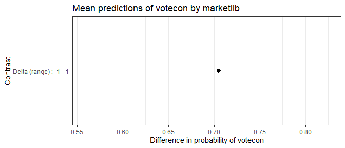
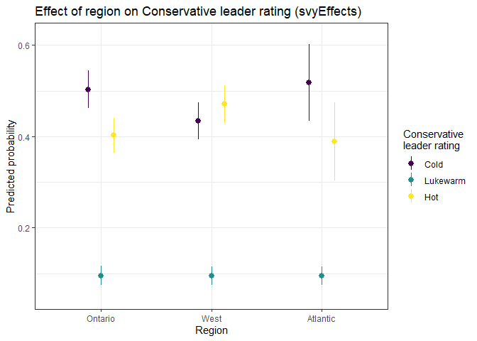
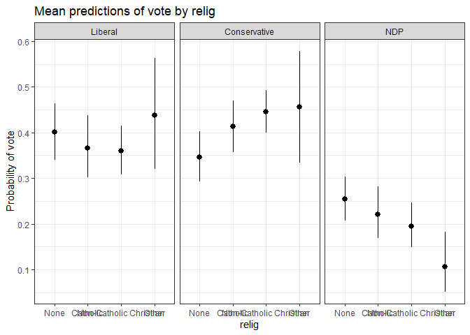

svyEffects
================

## Introduction

An oft-cited reason why `R` is not more widely used in social science
research is its disjointed and incomplete set of tools to deal with
weights. `{svyEffects}` helps address this problem by providing a suite
of post-estimation tools for working with limited dependent variable
models (binary, ordinal, and multinomial logit) estimated on
survey-weighted data.

Its main set of functions calculate predicted probabilities using
either:

-   the *average marginal effects* approach (also known as *marginal
    effects at observed values*, or *adjusted predictions*); or
-   the *marginal effects at reasonable/representative/typical values*
    approach (also known as *marginal effects for the average case*).

These approaches are analogous to Stata’s commands `margins x` and
`margins x, at`, respectively.

After calculating predicted probabilities, it will then calculate
differences in probabilities (also known as *contrasts*/*pairwise
comparisons* for categorical predictors or *first differences* for
continuous predictors) using:

-   for continuous predictors, the change across the entire range of the
    variable (by default), or a one-unit or one-standard-deviation
    change centred on the mean; or
-   for categorical predictors, all pairwise differences.

For both predictions and differences, it uses simulation methods (the
parametric bootstrap) to derive 95% confidence intervals.

It works with the following survey-weighted models or (non-survey)
weighted models (i.e. models estimated with the `weight=` option
enabled):

-   Binary logit models
    -   `survey::svyglm`
    -   `glm`
-   Ordinal logit models
    -   `MASS::polr`
    -   `survey::svyolr`
-   Multinomial logit models
    -   `svrepmisc::svymultinom`
    -   `nnet::multinom`

Also included in the package are:

-   A snippet of the 2019 Canadian Election Study online survey for
    testing and demonstration purposes. This can be loaded with the
    command `data(ces19w)`.
-   A `plot()` method that creates a `ggplot` object of predicted
    probabilities or differences in predicted probabilities. This plot
    can be modified by adding further `ggplot` commands, which is shown
    below.
-   A function `mnlSig` that displays a concise summary of multinomial
    logit coefficients with statistical significance stars. This has
    been adapted for use on `svymultinom` objects from Dave Armstrong’s
    original function from `{DAMisc}`, which works for `multinom`
    objects.

------------------------------------------------------------------------

# Development history and differences from other packages

This package extends functions originally written by Dave Armstrong,
some of which are in his `{DAMisc}` package
(<https://github.com/davidaarmstrong/damisc>).

The reporting functions and naming conventions are inspired by Daniel
Ludecke’s excellent `{ggeffects}` package
(<https://github.com/strengejacke/ggeffects>). Current users of
`ggeffects` will notice similarities between `{svyEffects}` and
`{ggeffects}`. However, while `{ggeffects}` can estimate MER
probabilities (what it calls *adjusted predictions*) with `svyglm`
objects, it is not compatible with either `svyolr` or `svymultinom`
objects. Moreover, `{svyEffects}` estimates true average marginal
effects, which is the estimate of a variable’s effect on a given outcome
at the population level as opposed to a variable’s effect for a
hypothetical “average case” that may or may not exist or even be
theoretically plausible. (A detailed discussion of the difference is in
Hanmer and Kalkan 2013, *AJPS*, the full citation of which can be found
in the reference section at the end of this readme.)

Note: because AMEs run simulations on multiple copies of your dataset,
they can take much more time to calculate than MERs, particularly on
large datasets or when using an older computer. Those needing quick
results can calculate MERs (which, in practice *usually* substantively
similar to AMEs) and then decide from there for which variables they
want to calculate AMEs.

------------------------------------------------------------------------

# Binary dependent variable models

To demonstrate how this function works with binary dependent variables,
we’ll model voting for the Conservative Party of Canada versus voting
for any other party.

``` r
data(ces19w)

library(survey)
ces19w_svy <- survey::svydesign(ids = ~1, strata = NULL, weights = ~sampleweight, 
                                data = ces19w, digits = 3)

VOTECON <- survey::svyglm(votecon ~ agegrp + educ + region + market, 
                          design = ces19w_svy, family = binomial)
summary(VOTECON)
#> 
#> Call:
#> svyglm(formula = votecon ~ agegrp + educ + region + market, design = ces19w_svy, 
#>     family = binomial)
#> 
#> Survey design:
#> survey::svydesign(ids = ~1, strata = NULL, weights = ~sampleweight, 
#>     data = ces19w, digits = 3)
#> 
#> Coefficients:
#>                  Estimate Std. Error t value Pr(>|t|)    
#> (Intercept)      -0.79435    0.22139  -3.588 0.000344 ***
#> agegrp35-54       0.40053    0.18810   2.129 0.033382 *  
#> agegrp55+         0.25436    0.19639   1.295 0.195465    
#> educHS/College   -0.27230    0.16314  -1.669 0.095302 .  
#> educCollege Grad -0.55948    0.16759  -3.338 0.000863 ***
#> regionAtlantic    0.04245    0.26452   0.160 0.872517    
#> regionWest        0.48065    0.15640   3.073 0.002155 ** 
#> regionQuebec     -0.61201    0.18361  -3.333 0.000879 ***
#> market            1.58673    0.20924   7.583 5.84e-14 ***
#> ---
#> Signif. codes:  0 '***' 0.001 '**' 0.01 '*' 0.05 '.' 0.1 ' ' 1
#> 
#> (Dispersion parameter for binomial family taken to be 1.018649)
#> 
#> Number of Fisher Scoring iterations: 4
```

Let’s look at the effect of educational attainment (`educ`), a
categorical predictor with three levels: high school or less, some
post-secondary, and a university degree at the bachelor’s level or
higher.

The function `svyAME` will return average marginal effects for
education, or the effect of a change in education, holding all other
variables at observed values. We’ll specify a seed value for
reproducibility purposes.

The function’s output is a list that contains three data frames:

-   `$preds`: predicted probabilities
-   `$diffs`: differences in predicted probabilities
-   `$seed`: the seed value used for the simulations

``` r
library(svyEffects)
VOTECON_educ_ame <- svyEffects::svyAME(VOTECON,
                                       varname = "educ",
                                       weightvar = "sampleweight",
                                       seed = 2019)
VOTECON_educ_ame$preds
#> # A tibble: 3 x 5
#>   educ         predicted conf.low conf.high type       
#>   <fct>            <dbl>    <dbl>     <dbl> <chr>      
#> 1 <HS              0.337    0.294     0.384 Probability
#> 2 HS/College       0.286    0.246     0.328 Probability
#> 3 College Grad     0.236    0.199     0.276 Probability
VOTECON_educ_ame$diffs
#> # A tibble: 3 x 5
#>   educ                      predicted conf.low conf.high type      
#>   <chr>                         <dbl>    <dbl>     <dbl> <chr>     
#> 1 HS/College - <HS            -0.0513   -0.115   0.0110  Difference
#> 2 College Grad - <HS          -0.101    -0.162  -0.0421  Difference
#> 3 College Grad - HS/College   -0.0494   -0.103   0.00552 Difference
VOTECON_educ_ame$seed
#> [1] 2019
```

The outputs of this function lend themselves well to plotting using
`{ggplot2}`. As an example, let’s plot the predicted probabilities of
voting Conservative across levels of education.

``` r
library(ggplot2)
ggplot(VOTECON_educ_ame$preds) +
  aes(x = educ,
      y = predicted,
      ymin = conf.low,
      ymax = conf.high) +
  geom_pointrange() +
  labs(title = "Probability of voting Conservative by education",
       y = "Predicted probability",
       x = "Education")
```

<!-- -->

For convenience, `{svyEffects}` also includes a `plot()` method, which
uses the `{ggplot2}` engine to visualize either predicted probabilities
or differences in predicted probabilities.

By default, the predicted probabilities are plotted, as shown below.

``` r
plot(VOTECON_educ_ame)
```

<!-- -->

Note that labelling is minimal on the automatically-generated plots, but
you can add your own customization using `{ggplot2}`’s code conventions.

``` r
plot(VOTECON_educ_ame) +
  scale_y_continuous(labels = scales::percent) +
  labs(title = "My title",
       subtitle = "My subtitle",
       x = "My xvar label",
       y = "My yvar label",
       caption = "My caption") +
  theme_classic()
```

<!-- -->

You can also plot the differences in predicted probabilities between
levels of education by including the option `what = "diffs"` (or simply
`"diffs"`) in the `plot()` function call.

``` r
plot(VOTECON_educ_ame, "diffs")
```

<!-- -->

Now, let’s look at the effect of market liberalism, a continuous
predictor that ranges from -1 (minimal market liberalism, or the most
left-wing position) to +1 (maximal market liberalism, or the most
right-wing position).

Note that, because the function returns a first difference for
continuous predictors, the graph is not any more illuminating than the
summary statistic.

``` r
VOTECON_market_ame <- svyAME(VOTECON,
                             varname = "market",
                             weightvar = "sampleweight",
                             seed = 2019)
VOTECON_market_ame$preds
#> # A tibble: 11 x 5
#>    market predicted conf.low conf.high type       
#>     <dbl>     <dbl>    <dbl>     <dbl> <chr>      
#>  1 -1        0.0901   0.0614     0.127 Probability
#>  2 -0.8      0.118    0.0872     0.154 Probability
#>  3 -0.6      0.154    0.123      0.190 Probability
#>  4 -0.4      0.199    0.171      0.228 Probability
#>  5 -0.2      0.251    0.227      0.277 Probability
#>  6  0        0.312    0.286      0.339 Probability
#>  7  0.200    0.380    0.340      0.417 Probability
#>  8  0.4      0.453    0.395      0.508 Probability
#>  9  0.6      0.526    0.453      0.597 Probability
#> 10  0.8      0.598    0.513      0.683 Probability
#> 11  1        0.667    0.568      0.758 Probability
VOTECON_market_ame$diffs
#> # A tibble: 1 x 5
#>   market                 predicted conf.low conf.high type      
#>   <chr>                      <dbl>    <dbl>     <dbl> <chr>     
#> 1 Delta (range) : -1 - 1     0.576    0.446     0.693 Difference
VOTECON_market_ame$seed
#> [1] 2019
plot(VOTECON_market_ame)
```

<!-- -->

``` r
plot(VOTECON_market_ame, "diffs")
```

<!-- -->

------------------------------------------------------------------------

# Ordinal dependent variable models

To demonstrate ordinal dependent variables, we’ll model feeling
thermometer ratings for the leader of the Conservative Party of Canada.
This variable usually ranges from 0 to 100. But, for this example, we’ll
used a binned ordinal measure of “cold” (0-39), “lukewarm” (40-59), and
“hot” (60-100).

``` r
data(ces19w)
ces19w <- ces19w

library(survey)
ces19w_svy <- svydesign(ids = ~1, strata = NULL, weights = ~sampleweight, 
                        data = ces19w, digits = 3)

CONLDR <- svyolr(ldr_con_ft ~ agegrp + educ + region + market, 
                 design = ces19w_svy)
summary(CONLDR)
#> Call:
#> svyolr(ldr_con_ft ~ agegrp + educ + region + market, design = ces19w_svy)
#> 
#> Coefficients:
#>                        Value Std. Error    t value
#> agegrp35-54       0.15664575  0.1475754  1.0614624
#> agegrp55+        -0.10921024  0.1546726 -0.7060738
#> educHS/College    0.15437828  0.1348708  1.1446384
#> educCollege Grad -0.06967856  0.1364041 -0.5108247
#> regionAtlantic    0.03972267  0.2281063  0.1741410
#> regionWest        0.22507026  0.1426774  1.5774765
#> regionQuebec      0.28055289  0.1317431  2.1295449
#> market            1.54297494  0.1701424  9.0687278
#> 
#> Intercepts:
#>               Value   Std. Error t value
#> Cold|Lukewarm -0.8686  0.1896    -4.5808
#> Lukewarm|Hot   0.7938  0.1911     4.1537
#> (2532 observations deleted due to missingness)
```

Here’s the effect of education on feelings towards the Conservative
Party leader.

``` r
CONLDR_educ_ame <- svyAME(CONLDR,
                          varname = "educ",
                          weightvar = "sampleweight",
                          seed = 2019)
CONLDR_educ_ame$preds
#> # A tibble: 9 x 6
#>   y        educ         predicted conf.low conf.high type       
#>   <fct>    <fct>            <dbl>    <dbl>     <dbl> <chr>      
#> 1 Cold     <HS              0.313    0.271     0.356 Probability
#> 2 Lukewarm <HS              0.369    0.341     0.396 Probability
#> 3 Hot      <HS              0.318    0.278     0.362 Probability
#> 4 Cold     HS/College       0.281    0.248     0.315 Probability
#> 5 Lukewarm HS/College       0.367    0.340     0.395 Probability
#> 6 Hot      HS/College       0.351    0.314     0.391 Probability
#> 7 Cold     College Grad     0.327    0.287     0.369 Probability
#> 8 Lukewarm College Grad     0.369    0.341     0.396 Probability
#> 9 Hot      College Grad     0.304    0.265     0.342 Probability
CONLDR_educ_ame$diffs
#> # A tibble: 9 x 6
#>   y        educ                      predicted conf.low conf.high type      
#>   <fct>    <chr>                         <dbl>    <dbl>     <dbl> <chr>     
#> 1 Cold     HS/College - <HS          -0.0313   -0.0809    0.0188  Difference
#> 2 Lukewarm HS/College - <HS          -0.00167  -0.00710   0.00212 Difference
#> 3 Hot      HS/College - <HS           0.0330   -0.0200    0.0857  Difference
#> 4 Cold     College Grad - <HS         0.0147   -0.0421    0.0717  Difference
#> 5 Lukewarm College Grad - <HS        -0.000171 -0.00378   0.00298 Difference
#> 6 Hot      College Grad - <HS        -0.0145   -0.0722    0.0412  Difference
#> 7 Cold     College Grad - HS/College  0.0460   -0.00182   0.0967  Difference
#> 8 Lukewarm College Grad - HS/College  0.00150  -0.00251   0.00678 Difference
#> 9 Hot      College Grad - HS/College -0.0475   -0.0993    0.00184 Difference
plot(CONLDR_educ_ame)
```

<!-- -->

``` r
plot(CONLDR_educ_ame, "diffs")
```

<!-- -->

Here’s the effect of market liberalism.

``` r
CONLDR_market_ame <- svyAME(CONLDR,
                            varname = "market",
                            weightvar = "sampleweight",
                            diffchange = "range",
                            seed = 2019)
CONLDR_market_ame$preds
#> # A tibble: 33 x 6
#>    y        market predicted conf.low conf.high type       
#>    <fct>     <dbl>     <dbl>    <dbl>     <dbl> <chr>      
#>  1 Cold     -1         0.613   0.538      0.682 Probability
#>  2 Lukewarm -1         0.278   0.233      0.322 Probability
#>  3 Hot      -1         0.110   0.0820     0.145 Probability
#>  4 Cold     -0.813     0.544   0.484      0.605 Probability
#>  5 Lukewarm -0.813     0.316   0.277      0.351 Probability
#>  6 Hot      -0.813     0.140   0.109      0.176 Probability
#>  7 Cold     -0.627     0.475   0.426      0.525 Probability
#>  8 Lukewarm -0.627     0.348   0.318      0.378 Probability
#>  9 Hot      -0.627     0.177   0.147      0.210 Probability
#> 10 Cold     -0.440     0.405   0.367      0.442 Probability
#> # ... with 23 more rows
CONLDR_market_ame$diffs
#> # A tibble: 3 x 6
#>   y        market                     predicted conf.low conf.high type      
#>   <fct>    <fct>                          <dbl>    <dbl>     <dbl> <chr>     
#> 1 Cold     Delta (range) : -1 - 0.866   -0.528    -0.605   -0.451  Difference
#> 2 Lukewarm Delta (range) : -1 - 0.866   -0.0386   -0.100    0.0256 Difference
#> 3 Hot      Delta (range) : -1 - 0.866    0.566     0.483    0.642  Difference
plot(CONLDR_market_ame)
```

<!-- -->

``` r
plot(CONLDR_market_ame, "diffs")
```

<!-- -->

For ordinal and multinomial probabilities, the plot method follows the
conventions used by the `{ggeffects}` package (i.e. facetting by
response level). But, you can re-create the `Stata` default of
colour-coding the response level by writing your own `ggplot` command,
as shown below.

``` r
ggplot(CONLDR_market_ame$preds) +
  aes(x = market, y = predicted, ymin = conf.low, ymax = conf.high, colour = y, fill = y) +
  geom_line() +
  geom_ribbon(colour = "transparent", alpha = 0.2) +
  labs(title = "Effect of market liberalism on Conservative leader ratings",
       x = "Market liberalism (least to most)",
       y = "Predicted probability",
       fill = "Rating",
       colour = "Rating") +
  theme_bw()
```

<!-- -->

------------------------------------------------------------------------

# Multinomial dependent variable models

To demonstrate multinomial dependent variables, we’ll model vote choice
in the 2019 Canadian Federal Election. To keep things simple, we’ll
limit our analysis to the three major parties (the Liberals,
Conservatives, and New Democrats) and exclude the province of Quebec
(which has a different party system and patterns of vote choice).

There is no way to directly estimate a multinomial model with the
`{survey}` package in R. The package `{svyrepmisc}` generates an
approximation by turning the weighting scheme into replicate weights and
estimating the model with those. It uses the jackknife to calculate
variances.

We’ll go through this process step-by-step. First, we’ll import the
data, do some data cleaning, and then create our usual survey-design
object.

``` r
data(ces19w)
ces19w <- ces19w %>%
  filter(region != "Quebec") %>%
  filter(vote %in% c("Liberal", "Conservative", "NDP")) %>%
  mutate(region = droplevels(region),
         vote = droplevels(vote)) 

library(survey)
ces19w_svy <- svydesign(ids = ~1, strata = NULL, weights = ~sampleweight, 
                        data = ces19w, digits = 3)
```

Now, we’ll use the function `as.svrepdesign()` from `{survey}` to turn
our sampling weights into replicate weights with variances calculated
using the jackknife.

``` r
ces19w_svy_r <- as.svrepdesign(ces19w_svy, type = "JK1")
```

After our survey design object with replicate weights and jackknife
variances is created, we can use the function `svymultinom` from
`{svyrepmisc}` to run our vote choice model.

Note: use the option `trace = FALSE` in the `svymultinom()` function
call to suppress the reporting of each replication (similar to using the
option `quietly` in Stata).

Included with `{svyEffects}` the function `mnlSig`, which displays
coefficients from multinomial logit models and flags statistically
significant ones. `mnlSig` is adapted from Dave Armstrong’s original
function from his `{DAMisc}` package.

``` r
# remotes::install_github("carlganz/svrepmisc")
library(svrepmisc)

VOTE <- svymultinom(vote ~ region + educ + relig + market, 
                    design = ces19w_svy_r, trace = FALSE)
mnlSig(VOTE)
#>                             Conservative     NDP
#> (Intercept)                       0.174  -0.528 
#> regionAtlantic                   -0.115  -0.019 
#> regionWest                        1.008*  0.839*
#> educHS/College                   -0.433  -0.164 
#> educCollege Grad                 -0.810*  0.042 
#> religNon-Catholic Christian       0.700* -0.249 
#> religCatholic                     0.149  -0.487 
#> religOther                       -2.161* -2.683 
#> market                            1.690* -1.261*
```

For our post-estimation command, we’ll need to specify a few more
options because `svymultinom` does not store them in its output. These
are:

-   `design`: the survey design object used to estimate the model; and
-   `modform`: the model formula used in the `svymultinom` call (in the
    form `modform = "y ~ x1 + x2 + x3"`).

Here’s the effect of education.

``` r
VOTE_educ_ame <- svyAME(VOTE,
                        varname = "educ",
                        weightvar = "sampleweight",
                        seed = 2019,
                        design = ces19w_svy_r,
                        modform = "vote ~ region + educ + relig + market")
VOTE_educ_ame$preds
#> # A tibble: 9 x 6
#>   y            educ         predicted conf.low conf.high type       
#>   <fct>        <fct>            <dbl>    <dbl>     <dbl> <chr>      
#> 1 Liberal      <HS              0.270    0.208     0.338 Probability
#> 2 Conservative <HS              0.517    0.451     0.588 Probability
#> 3 NDP          <HS              0.212    0.158     0.281 Probability
#> 4 Liberal      HS/College       0.337    0.273     0.399 Probability
#> 5 Conservative HS/College       0.441    0.383     0.500 Probability
#> 6 NDP          HS/College       0.222    0.171     0.282 Probability
#> 7 Liberal      College Grad     0.361    0.302     0.429 Probability
#> 8 Conservative College Grad     0.351    0.297     0.408 Probability
#> 9 NDP          College Grad     0.288    0.236     0.342 Probability
VOTE_educ_ame$diffs
#> # A tibble: 9 x 6
#>   y            educ                      predicted  conf.low conf.high type     
#>   <fct>        <chr>                         <dbl>     <dbl>     <dbl> <chr>    
#> 1 Liberal      HS/College - <HS            0.0667  -0.0274     0.158   Differen~
#> 2 Conservative HS/College - <HS           -0.0764  -0.165      0.0128  Differen~
#> 3 NDP          HS/College - <HS            0.00969 -0.0776     0.0937  Differen~
#> 4 Liberal      College Grad - <HS          0.0908   0.000869   0.182   Differen~
#> 5 Conservative College Grad - <HS         -0.166   -0.258     -0.0786  Differen~
#> 6 NDP          College Grad - <HS          0.0753  -0.00788    0.153   Differen~
#> 7 Liberal      College Grad - HS/College   0.0241  -0.0607     0.116   Differen~
#> 8 Conservative College Grad - HS/College  -0.0897  -0.174     -0.00673 Differen~
#> 9 NDP          College Grad - HS/College   0.0657  -0.0130     0.142   Differen~
plot(VOTE_educ_ame)
```

<!-- -->

``` r
plot(VOTE_educ_ame, "diffs")
```

<!-- -->

Here’s the effect of market liberalism.

``` r
VOTE_market_ame <- svyAME(VOTE,
                          varname = "market",
                          weightvar = "sampleweight",
                          design = ces19w_svy_r,
                          diffchange = "range",
                          modform = "vote ~ region + educ + relig + market",
                          seed = 2019)
VOTE_market_ame$preds
#> # A tibble: 33 x 6
#>    y            market predicted conf.low conf.high type       
#>    <fct>         <dbl>     <dbl>    <dbl>     <dbl> <chr>      
#>  1 Liberal      -1        0.311    0.212      0.424 Probability
#>  2 Conservative -1        0.0978   0.0568     0.151 Probability
#>  3 NDP          -1        0.591    0.473      0.706 Probability
#>  4 Liberal      -0.813    0.338    0.253      0.428 Probability
#>  5 Conservative -0.813    0.144    0.0960     0.201 Probability
#>  6 NDP          -0.813    0.519    0.424      0.615 Probability
#>  7 Liberal      -0.627    0.356    0.288      0.427 Probability
#>  8 Conservative -0.627    0.205    0.154      0.262 Probability
#>  9 NDP          -0.627    0.439    0.367      0.514 Probability
#> 10 Liberal      -0.440    0.363    0.309      0.416 Probability
#> # ... with 23 more rows
VOTE_market_ame$diffs
#> # A tibble: 3 x 6
#>   y            market                     predicted conf.low conf.high type     
#>   <fct>        <chr>                          <dbl>    <dbl>     <dbl> <chr>    
#> 1 Liberal      Delta (range) : -1 - 0.866    -0.214   -0.333   -0.0989 Differen~
#> 2 Conservative Delta (range) : -1 - 0.866     0.495    0.341    0.630  Differen~
#> 3 NDP          Delta (range) : -1 - 0.866    -0.434   -0.552   -0.306  Differen~
plot(VOTE_market_ame)
```

<!-- -->

``` r
plot(VOTE_market_ame, "diffs")
```

<!-- -->

------------------------------------------------------------------------

# Marginal effects at reasonable values

*(documentation in progress)*

You can choose to calculate marginal effects at reasonable values (MER)
probabilities and differences by using the `svyMER` function, which
follows the same arguments as `svyAME`. This command would give you the
estimated effect of a variable “for the ‘typical’ case” (which may or
may not be typical, plausible, or even possible in the real world) as
opposed to the effect of a variable across the population (see Hanmer
and Kalkan 2013 for an in-depth discussion).

MER probabilities are *usually* very similar to AME probabilities, but
not always. However, they are *much* faster to calculate using
simulation methods.

------------------------------------------------------------------------

# Interaction effects

*(documentation in progress)*

Both `svyAME` and `svyMER` support calculating predicted probabilities
of combinations of two predictor variables. This can be done by using
the argument `byvar = "x"` in the function call.

This will not return differences in predicted probabilities. For
limited-dependent variable models, one would need to calculate a second
difference would be needed to test for the significance of an
interaction between two variables, either from the inclusion of a
product term or through the compression inherent in these types of
models (see Norton, Wang, and Ai 2004).

Dave Armstrong’s `{DAMisc}` package has an `R` port for Norton, Wang,
and Ai’s original `Stata` function, and this will eventually be ported
to `{svyEffects}` for use in survey-weighted models.

------------------------------------------------------------------------

# Planned updates

This package is under active development, and updates will include:

1.  Support for (non-survey) weighted models and weighted models. While
    there are other packages that do this, some do not return confidence
    intervals for predictions for some model types. And, to my
    knowledge, none use simulation methods to derive confidence
    intervals. *Note: You can actually already do this with
    `{svyEffects}` by creating a survey design object with a weight of
    “1”, but it would be good to avoid having to use that workaround.*
2.  In-depth comparisons with Stata results.
3.  Functions for calculating weighted model fit measures.
4.  Support for using an alternative variance-covariance matrix using
    `{sandwich}`. This would only be for binary logit models because
    `{sandwich}` does not play nice with ordinal or multinomial models.
    That said, survey-weighted models do adjust the variance-covariance
    matrix (the documentation for `{survey}` does not specify the
    correction method it uses, but it appears to be HC0, based on what
    I’ve seen).
5.  A second differences function to test for the significance of a
    two-way interaction.
6.  (Possibly) Use of the delta method to calculate confidence intervals
    for AMEs probabilities to speed up computational time.

------------------------------------------------------------------------

# References

Hanmer, M.J. and K.O. Kalkan. 2013. “Behind the Curve: Clarifying the
Best Approach to Calculating Predicted Probabilities and Marginal
Effects from Limited Dependent Variable Models.” *American Journal of
Political Science*. 57(1): 263-277.

Norton, Edward C., Hua Wang and Chunrong Ai. 2004. Computing Interaction
Effects and Standard Errors in Logit and Probit Models. *The Stata
Journal* 4(2): 154-167.

Rainey, Carlisle. 2016. “Compression and Conditional Effects: A Product
Term Is Essential When Using Logistic Regression to Test for
Interaction.” *Political Science Research and Methods* 4(3): 621-639.

Stephenson, Laura B; Harell, Allison; Rubenson, Daniel; Loewen, Peter
John, 2020, “2019 Canadian Election Study - Online Survey,”
<https://doi.org/10.7910/DVN/DUS88V>, Harvard Dataverse, V1.
