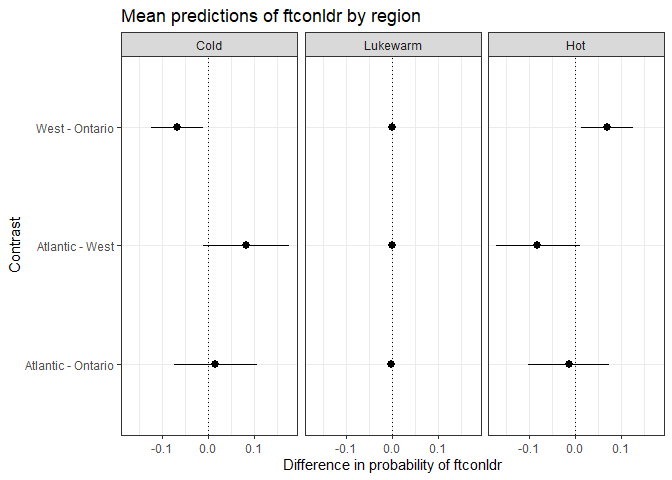

svyEffects
================

- <a href="#how-to-install-svyeffects"
  id="toc-how-to-install-svyeffects">How to install
  <code>svyEffects</code></a>
- <a href="#introduction" id="toc-introduction">Introduction</a>
- <a href="#development-history-and-differences-from-other-packages"
  id="toc-development-history-and-differences-from-other-packages">Development
  history and differences from other packages</a>
- <a href="#binary-dependent-variable-models"
  id="toc-binary-dependent-variable-models">Binary dependent variable
  models</a>
  - <a href="#predictions-on-a-categorical-variable"
    id="toc-predictions-on-a-categorical-variable">Predictions on a
    categorical variable</a>
  - <a href="#plotting" id="toc-plotting">Plotting</a>
  - <a href="#predictions-on-a-continuous-variable"
    id="toc-predictions-on-a-continuous-variable">Predictions on a
    continuous variable</a>
- <a href="#ordinal-dependent-variable-models"
  id="toc-ordinal-dependent-variable-models">Ordinal dependent variable
  models</a>
  - <a href="#predictions-on-a-categorical-variable-1"
    id="toc-predictions-on-a-categorical-variable-1">Predictions on a
    categorical variable</a>
  - <a href="#predictions-on-a-continuous-variable-1"
    id="toc-predictions-on-a-continuous-variable-1">Predictions on a
    continuous variable</a>
- <a href="#multinomial-dependent-variable-models"
  id="toc-multinomial-dependent-variable-models">Multinomial dependent
  variable models</a>
  - <a href="#predictions-on-a-categorical-variable-2"
    id="toc-predictions-on-a-categorical-variable-2">Predictions on a
    categorical variable</a>
  - <a href="#predictions-on-a-continuous-variable-2"
    id="toc-predictions-on-a-continuous-variable-2">Predictions on a
    continuous variable</a>
- <a href="#marginal-effects-at-reasonable-values"
  id="toc-marginal-effects-at-reasonable-values">Marginal effects at
  reasonable values</a>
- <a href="#interaction-effects" id="toc-interaction-effects">Interaction
  effects</a>
- <a href="#measures-of-model-fit" id="toc-measures-of-model-fit">Measures
  of model fit</a>
- <a href="#planned-updates" id="toc-planned-updates">Planned updates</a>
- <a href="#references" id="toc-references">References</a>
- <a href="#appendix-detailed-comparisons-with-stata-results"
  id="toc-appendix-detailed-comparisons-with-stata-results">Appendix:
  Detailed comparisons with <code>Stata</code> results</a>
  - <a href="#binary-logit" id="toc-binary-logit">Binary logit</a>
  - <a href="#ordered-logit" id="toc-ordered-logit">Ordered logit</a>
  - <a href="#mulitnomial-logit" id="toc-mulitnomial-logit">Mulitnomial
    logit</a>

## How to install `svyEffects`

Run the code below in an `R` or `RStudio` session, and it will install
`{svyEffects}`. You’ll need the `{remotes}` package, if you don’t
already have it (which is why it’s included in the code). If you already
have it, then just skip the first line.

    install.packages("remotes")
    library(remotes)
    remotes::install_github("jb-santos/svyEffects", force = TRUE)

*Note: if you have installed a previous version of this package and want
to update, ensure you include the argument `force = TRUE` in the
function call because all versions of a GitHub packages are
v0.0.0.9000.*

## Introduction

An oft-cited reason why `R` is not more widely used in social science
research is its disjointed and incomplete set of tools to deal with
weights. `{svyEffects}` helps address this problem by providing a suite
of post-estimation tools for working with limited dependent variable
models (binary, ordinal, and multinomial logit) estimated on
survey-weighted data.

Its main set of functions calculate predicted probabilities using
either:

- the *average marginal effects* approach (also known as *marginal
  effects at observed values*); or
- the *marginal effects at reasonable/representative/typical values*
  approach (also known as *marginal effects for the average case*).

These approaches are analogous to `Stata`’s commands `margins x` and
`margins x, at`, respectively.

After calculating predicted probabilities, it will then calculate
differences in probabilities (also known as *contrasts*/*pairwise
comparisons* for categorical predictors and *first differences* for
continuous predictors) using:

- for continuous predictors, the change across the entire range of the
  variable (by default), or a one-unit change centred on the mean or a
  one-standard-deviation change centred on the mean; or
- for categorical predictors, all pairwise differences.

For both predictions and differences, it uses simulation methods (the
parametric bootstrap) to derive 95% confidence intervals.

It works with the following survey-weighted model objects:
`survey::svyglm` (binary logit), `survey::svyolr` (ordered logit),
`svrepmisc::svymultinom` (multinomial logit).

Eventually, support for (non-survey) weighted model objects (i.e. models
estimated with the `weight` option) will be added for `glm`,
`MASS::polr`, and `nnet::multinom`.

Also included in the package are:

- A `plot` method that creates a `ggplot` object of predicted
  probabilities or differences in predicted probabilities. This plot can
  be modified by adding further `ggplot` commands, which is shown below.
- A function `svyPRE` that calculates the proportional reductions in
  error for `svyglm` and `svyolr` models (functionality for
  `svymultinom` models in development).
- A function `mnlSig` that displays a concise summary of multinomial
  logit coefficients with statistical significance stars. This has been
  adapted for use on `svymultinom` objects from Dave Armstrong’s
  original function from `{DAMisc}`, which works for `multinom` objects.
- A snippet of the 2019 Canadian Election Study Online Survey for
  testing and demonstration purposes. This can be loaded with the
  command `data(ces19)`.

------------------------------------------------------------------------

# Development history and differences from other packages

This package extends functions originally written by Dave Armstrong,
some of which are in his `{DAMisc}` package
(<https://github.com/davidaarmstrong/damisc>).

The reporting functions and naming conventions are inspired by Daniel
Ludecke’s excellent `{ggeffects}` package
(<https://github.com/strengejacke/ggeffects>). Current users of
`{ggeffects}` will notice similarities between `{svyEffects}` and
`{ggeffects}`. However, while `{ggeffects}` can estimate MER
probabilities (what it calls *adjusted predictions*) with `svyglm`
objects, it is not compatible with either `svyolr` or `svymultinom`
objects. Moreover, `{svyEffects}` estimates true average marginal
effects, which is the estimate of a variable’s effect on a given outcome
at the population level as opposed to a variable’s effect for a
hypothetical “average case” that may or may not exist or even be
theoretically plausible. (A detailed discussion of the difference is in
Hanmer and Kalkan 2013, *AJPS*, the full citation of which can be found
in the reference section.)

Note: because AMEs run simulations on multiple copies of your dataset,
they can take much more time to calculate than MERs, particularly on
large datasets or when using an older computer. Those needing quick
results can calculate MERs (which, in practice *usually* substantively
similar to AMEs) and then decide from there for which variables they
want to calculate AMEs.

------------------------------------------------------------------------

# Binary dependent variable models

To demonstrate how this function works with binary dependent variables,
we’ll model voting for the Conservative Party of Canada versus voting
for any other party.

``` r
library(svyEffects)
data(ces19)

library(survey)
ces19_svy <- svydesign(ids = ~1, strata = NULL, weights = ~pesweight, 
                       data = ces19, digits = 3)

VOTECON <- svyglm(votecon ~ agegrp + gender + educ + region + relig + marketlib + culturetrad, 
                  design = ces19_svy, family = binomial)
summary(VOTECON)
#> 
#> Call:
#> svyglm(formula = votecon ~ agegrp + gender + educ + region + 
#>     relig + marketlib + culturetrad, design = ces19_svy, family = binomial)
#> 
#> Survey design:
#> svydesign(ids = ~1, strata = NULL, weights = ~pesweight, data = ces19, 
#>     digits = 3)
#> 
#> Coefficients:
#>                             Estimate Std. Error t value Pr(>|t|)    
#> (Intercept)                 -0.72420    0.42951  -1.686  0.09202 .  
#> agegrp35-54                  0.18969    0.30665   0.619  0.53630    
#> agegrp55+                    0.37571    0.30225   1.243  0.21407    
#> genderWoman/Other           -0.35954    0.18701  -1.923  0.05476 .  
#> educSome PSE                 0.02885    0.24444   0.118  0.90605    
#> educUni degree               0.08152    0.26961   0.302  0.76244    
#> regionWest                   0.64625    0.19603   3.297  0.00101 ** 
#> regionAtlantic               0.32897    0.35624   0.923  0.35596    
#> religCatholic                0.45252    0.26196   1.727  0.08433 .  
#> religNon-Catholic Christian  0.65283    0.22961   2.843  0.00454 ** 
#> religOther                   0.75055    0.39610   1.895  0.05834 .  
#> marketlib                    2.28579    0.30268   7.552 8.16e-14 ***
#> culturetrad                  1.96134    0.23845   8.225 4.76e-16 ***
#> ---
#> Signif. codes:  0 '***' 0.001 '**' 0.01 '*' 0.05 '.' 0.1 ' ' 1
#> 
#> (Dispersion parameter for binomial family taken to be 0.9166063)
#> 
#> Number of Fisher Scoring iterations: 5
```

The estimates from `survey::svyglm` closely resemble the ones from
`Stata`’s `logit` command with `[pweight=]` specified (see the
comparison tables in the Appendix).

## Predictions on a categorical variable

Let’s look at the effect of educational attainment (`educ`), a
categorical predictor with three levels: high school or less, some
post-secondary, and a university degree at the bachelor’s level or
higher.

The function `svyAME` will return average marginal effects for
education, or the effect of a change in education, holding all other
variables at observed values. We’ll specify a seed value for
reproducibility purposes.

The function’s output is a list that contains three data frames:

- `$preds`: predicted probabilities
- `$diffs`: differences in predicted probabilities
- `$seed`: the seed value used for the simulations

``` r
library(svyEffects)
VOTECON_educ_ame <- svyEffects::svyAME(VOTECON,
                                       varname = "educ",
                                       seed = 2019)
VOTECON_educ_ame$preds
#> # A tibble: 3 × 5
#>   educ       predicted conf.low conf.high type       
#>   <fct>          <dbl>    <dbl>     <dbl> <chr>      
#> 1 HS or less     0.403    0.340     0.469 Probability
#> 2 Some PSE       0.408    0.368     0.446 Probability
#> 3 Uni degree     0.416    0.373     0.458 Probability
```

Again, the results from `svyAME` match the `Stata` equivalent of
`margins` within 0.001 for the mean predicted probability and within
0.002 for the upper and lower 95% confidence bounds (see the relevant
table in the Appendix).

`svyAME` also calculates the differences in predicted probabilities for
all pairwise comparisons between levels of our predictor variable.

``` r
VOTECON_educ_ame$diffs
#> # A tibble: 3 × 5
#>   educ                    predicted conf.low conf.high type      
#>   <chr>                       <dbl>    <dbl>     <dbl> <chr>     
#> 1 Some PSE - HS or less     0.00424  -0.0682    0.0777 Difference
#> 2 Uni degree - HS or less   0.0130   -0.0715    0.0923 Difference
#> 3 Uni degree - Some PSE     0.00877  -0.0507    0.0676 Difference
```

The differences also compare favourably to the same results from
`Stata`. The `svyEffects` and `Stata` results differ by \<0.001.

    . lincom _b[2.educ] - _b[1.educ]

     ( 1)  - 1bn.educ + 2.educ = 0

    ------------------------------------------------------------------------------
                 |      Coef.   Std. Err.      z    P>|z|     [95% Conf. Interval]
    -------------+----------------------------------------------------------------
             (1) |   .0044692   .0378337     0.12   0.906    -.0696834    .0786218
    ------------------------------------------------------------------------------

    . lincom _b[3.educ] - _b[1.educ]

     ( 1)  - 1bn.educ + 3.educ = 0

    ------------------------------------------------------------------------------
                 |      Coef.   Std. Err.      z    P>|z|     [95% Conf. Interval]
    -------------+----------------------------------------------------------------
             (1) |   .0126461   .0417288     0.30   0.762    -.0691408     .094433
    ------------------------------------------------------------------------------

    . lincom _b[3.educ] - _b[2.educ]

     ( 1)  - 2.educ + 3.educ = 0

    ------------------------------------------------------------------------------
                 |      Coef.   Std. Err.      z    P>|z|     [95% Conf. Interval]
    -------------+----------------------------------------------------------------
             (1) |   .0081769   .0302207     0.27   0.787    -.0510547    .0674084
    ------------------------------------------------------------------------------

## Plotting

The outputs of this function lend themselves well to plotting using
`{ggplot2}`. As an example, let’s plot the predicted probabilities of
voting Conservative across levels of education.

``` r
library(ggplot2)
ggplot(VOTECON_educ_ame$preds) +
  aes(x = educ,
      y = predicted,
      ymin = conf.low,
      ymax = conf.high) +
  geom_pointrange() +
  labs(title = "Probability of voting Conservative by education",
       y = "Predicted probability",
       x = "Education")
```

<!-- -->

For convenience, `{svyEffects}` also includes a `plot` method, which
uses the `{ggplot2}` engine to visualize either predicted probabilities
or differences in predicted probabilities.

By default, the predicted probabilities are plotted, as shown below.

``` r
plot(VOTECON_educ_ame)
```

<!-- -->

Note that labelling is minimal on the automatically-generated plots, but
you can add your own customization using `{ggplot2}`’s code conventions.

``` r
plot(VOTECON_educ_ame) +
  scale_y_continuous(labels = scales::percent) +
  labs(title = "My title",
       subtitle = "My subtitle",
       x = "My xvar label",
       y = "My yvar label",
       caption = "My caption") +
  theme_classic()
```

<!-- -->

You can also plot the differences in predicted probabilities between
levels of education by including the option `what = "diffs"` (or simply
`"diffs"`) in the `plot` function call.

``` r
plot(VOTECON_educ_ame, "diffs") + 
  geom_hline(yintercept = 0, linetype = "dotted")
```

<!-- -->

## Predictions on a continuous variable

Now, let’s look at the effect of market liberalism, a continuous
predictor that ranges from -1 (minimal market liberalism, or the most
left-wing position) to +1 (maximal market liberalism, or the most
right-wing position).

``` r
VOTECON_marketlib_ame <- svyAME(VOTECON,
                                varname = "marketlib",
                                seed = 2019)
VOTECON_marketlib_ame$preds
#> # A tibble: 11 × 5
#>    marketlib predicted conf.low conf.high type       
#>        <dbl>     <dbl>    <dbl>     <dbl> <chr>      
#>  1    -1         0.123   0.0744     0.181 Probability
#>  2    -0.8       0.170   0.119      0.230 Probability
#>  3    -0.6       0.230   0.181      0.283 Probability
#>  4    -0.4       0.300   0.260      0.341 Probability
#>  5    -0.2       0.379   0.346      0.412 Probability
#>  6     0         0.465   0.429      0.504 Probability
#>  7     0.200     0.551   0.501      0.607 Probability
#>  8     0.4       0.634   0.566      0.702 Probability
#>  9     0.6       0.709   0.625      0.788 Probability
#> 10     0.8       0.778   0.685      0.856 Probability
#> 11     1         0.831   0.734      0.908 Probability
```

`svyAME` also produces very similar results to `Stata` for the effect of
market liberalism (see Appendix).

``` r
VOTECON_marketlib_ame$diffs
#> # A tibble: 1 × 5
#>   marketlib              predicted conf.low conf.high type      
#>   <chr>                      <dbl>    <dbl>     <dbl> <chr>     
#> 1 Delta (range) : -1 - 1     0.709    0.548     0.829 Difference
plot(VOTECON_marketlib_ame)
```

<!-- -->

Note that, because the function returns a first difference for
continuous predictors, the graph is not any more illuminating than the
summary statistic.

``` r
plot(VOTECON_marketlib_ame, "diffs") + 
  geom_hline(yintercept = 0, linetype = "dotted")
```

<!-- -->

------------------------------------------------------------------------

# Ordinal dependent variable models

To demonstrate ordinal dependent variables, we’ll model feeling
thermometer ratings for the leader of the Conservative Party of Canada.
This variable usually ranges from 0 to 100. But, for this example, we’ll
used a collapsed ordinal measure of “cold” (0-39), “lukewarm” (40-59),
and “hot” (60-100).

``` r
data(ces19)

library(survey)
ces19_svy <- svydesign(ids = ~1, strata = NULL, weights = ~pesweight, 
                        data = ces19, digits = 3)

CONLDR <- svyolr(ftconldr ~ agegrp + gender + educ + region + relig + marketlib + culturetrad, 
                 design = ces19_svy)
summary(CONLDR)
#> Call:
#> svyolr(ftconldr ~ agegrp + gender + educ + region + relig + marketlib + 
#>     culturetrad, design = ces19_svy)
#> 
#> Coefficients:
#>                                   Value Std. Error    t value
#> agegrp35-54                  0.17796372  0.2665702  0.6676055
#> agegrp55+                    0.04601115  0.2686809  0.1712483
#> genderWoman/Other           -0.49866393  0.1707825 -2.9198766
#> educSome PSE                -0.20802018  0.2231985 -0.9319963
#> educUni degree              -0.10211120  0.2430419 -0.4201383
#> regionWest                   0.41572273  0.1792462  2.3192838
#> regionAtlantic              -0.09551799  0.2884670 -0.3311228
#> religCatholic                0.46488829  0.2245240  2.0705501
#> religNon-Catholic Christian  0.60848101  0.2202608  2.7625480
#> religOther                   0.79950865  0.3459580  2.3109994
#> marketlib                    1.96343442  0.2572774  7.6315846
#> culturetrad                  1.95794984  0.2263782  8.6490220
#> 
#> Intercepts:
#>               Value   Std. Error t value
#> Cold|Lukewarm -0.4716  0.3817    -1.2356
#> Lukewarm|Hot   0.1141  0.3704     0.3079
```

## Predictions on a categorical variable

Here’s the effect of region on feelings towards the Conservative Party
leader.

For brevity, only the visualizations of the predicted
probabilities/differences are presented, along with comparisons versus
`Stata`. Detailed comparison tables can be seen in the Appendix.

``` r
CONLDR_region_ame <- svyAME(CONLDR,
                            varname = "region",
                            seed = 2019)
plot(CONLDR_region_ame)
```

<!-- -->

For ordinal and multinomial probabilities, the plot method follows the
conventions used by the `{ggeffects}` package (i.e. facetting by
response level). But, you can re-create the `Stata` default of
colour-coding the response level by writing your own `ggplot` command,
as shown below.

``` r
ggplot(CONLDR_region_ame$preds) + 
  aes(x = region, y = predicted, ymin = conf.low, ymax = conf.high, colour = y) +
  geom_pointrange(position = position_dodge2(.35)) +
  scale_y_continuous(limits = c(.05,.62)) +
  scale_colour_viridis_d() +
  labs(title = "Effect of region on Conservative leader rating (svyEffects)",
       x = "Region",
       y = "Predicted probability",
       colour = "Conservative \nleader rating") +
  theme_bw()
```

<!-- -->

The predicted probabilities for region are very similar to the `Stata`
results.


``` r
plot(CONLDR_region_ame, "diffs") +
  geom_hline(yintercept = 0, linetype = "dotted")
```

<!-- -->

## Predictions on a continuous variable

Here’s the effect of market liberalism:

``` r
CONLDR_marketlib_ame <- svyAME(CONLDR,
                            varname = "marketlib",
                            diffchange = "range",
                            seed = 2019)
plot(CONLDR_marketlib_ame)
```

<!-- -->

``` r
plot(CONLDR_marketlib_ame, "diffs") + 
  geom_hline(yintercept = 0, linetype = "dotted")
```

<!-- -->

The graph below shows the results similar to how `Stata` plots them.

``` r
ggplot(CONLDR_marketlib_ame$preds) +
  aes(x = marketlib, y = predicted, ymin = conf.low, ymax = conf.high, colour = y, fill = y) +
  geom_line() +
  geom_ribbon(colour = "transparent", alpha = 0.2) +
  scale_y_continuous(limits = c(0,1), breaks = seq(0, 1, length = 6)) +
  scale_x_continuous(breaks = seq(-1, 1, length = 6)) +
  scale_colour_viridis_d() +
  scale_fill_viridis_d() +
  labs(title = "Effect of market liberalism on Conservative leader ratings (svyEffects)",
       x = "Market liberalism (least to most)",
       y = "Predicted probability",
       fill = "Conservative \nleader rating",
       colour = "Conservative \nleader rating") +
  theme_bw()
```

<!-- -->

The `Stata` results are very similar.


------------------------------------------------------------------------

# Multinomial dependent variable models

To demonstrate multinomial dependent variables, we’ll model vote choice
in the 2019 Canadian Federal Election. To keep things simple, we’ll
limit our analysis to the three major parties (the Liberals,
Conservatives, and New Democrats) and exclude the province of Quebec
(which has a different party system and patterns of vote choice).

There is no way to directly estimate a multinomial model with the
`{survey}` package in `R`. The package `{svyrepmisc}` generates an
approximation by turning the weighting scheme into replicate weights and
estimating the model with those. It uses the jackknife to calculate
variances.

We’ll go through this process step-by-step. First, we’ll import the
data, do some data cleaning, and then create our usual survey-design
object.

``` r
data(ces19)
library(survey)
ces19_svy <- svydesign(ids = ~1, strata = NULL, weights = ~pesweight, 
                        data = ces19, digits = 3)
```

Now, we’ll use the function `as.svrepdesign()` from `{survey}` to turn
our sampling weights into replicate weights with variances calculated
using the jackknife.

``` r
ces19_svy_r <- as.svrepdesign(ces19_svy, type = "JK1")
```

After our survey design object with replicate weights and jackknife
variances is created, we can use the function `svymultinom` from
`{svyrepmisc}` to run our vote choice model.

Note: use the option `trace = FALSE` in the `svymultinom` function call
to suppress the reporting of each replication (similar to using the
option `quietly` in Stata).

Included with `{svyEffects}` the function `mnlSig`, which displays
coefficients from multinomial logit models and flags statistically
significant ones. `mnlSig` is adapted from Dave Armstrong’s original
function from his `{DAMisc}` package.

``` r
# remotes::install_github("carlganz/svrepmisc")
library(svrepmisc)

VOTE <- svymultinom(vote ~ agegrp + gender + educ + region + relig + marketlib + culturetrad, 
                    design = ces19_svy_r, trace = FALSE)
mnlSig(VOTE)
#>                             Conservative     NDP
#> (Intercept)                      -0.281  -0.764 
#> agegrp35-54                       0.075  -0.286 
#> agegrp55+                         0.052  -0.959*
#> genderWoman/Other                -0.267   0.266 
#> educSome PSE                      0.195   0.486 
#> educUni degree                    0.032  -0.166 
#> regionWest                        0.898*  0.751*
#> regionAtlantic                    0.334   0.017 
#> religCatholic                     0.418  -0.049 
#> religNon-Catholic Christian       0.581* -0.181 
#> religOther                        0.440  -1.083*
#> marketlib                         2.113* -0.516 
#> culturetrad                       1.990*  0.076
```

## Predictions on a categorical variable

For our post-estimation command, we’ll need to specify a few more
options because `svymultinom` does not store them in its output. These
are:

- `design`: the survey design object used to estimate the model;
- `modform`: the model formula used in the `svymultinom` call (in the
  form `modform = "y ~ x1 + x2 + x3"`); and
- `weightvar`: the name of the weight variable (in quotes).

*Note: I’ve submitted a pull request to `{svrepmisc}` to make some
changes that will remove the need to specify these options. These
changes should be incorporated within a few weeks, so check for
updates.*

Here’s the effect of education:

``` r
VOTE_region_ame <- svyAME(
  VOTE,
  varname = "region",
  seed = 2019,
  design = ces19_svy_r,
  modform = "vote ~ agegrp + gender + educ + region + relig + marketlib + culturetrad",
  weightvar = "pesweight")
VOTE_region_ame$preds
#> # A tibble: 9 × 6
#>   y            region   predicted conf.low conf.high type       
#>   <fct>        <fct>        <dbl>    <dbl>     <dbl> <chr>      
#> 1 Liberal      Ontario      0.445    0.398     0.493 Probability
#> 2 Conservative Ontario      0.361    0.321     0.403 Probability
#> 3 NDP          Ontario      0.194    0.157     0.236 Probability
#> 4 Liberal      West         0.285    0.240     0.333 Probability
#> 5 Conservative West         0.461    0.418     0.504 Probability
#> 6 NDP          West         0.254    0.213     0.298 Probability
#> 7 Liberal      Atlantic     0.408    0.294     0.535 Probability
#> 8 Conservative Atlantic     0.409    0.297     0.524 Probability
#> 9 NDP          Atlantic     0.182    0.117     0.261 Probability
```

``` r
plot(VOTE_region_ame)
```

<!-- -->

The predicted probabilities by region in `Stata` format:

``` r
ggplot(VOTE_region_ame$preds) +
  aes(x = region, y = predicted, ymin = conf.low, ymax = conf.high, colour = y) +
  geom_pointrange(position = position_dodge2(.2)) +
  scale_y_continuous(limits = c(.1,.55), breaks = c(.1,.2,.3,.4,.5)) +
  scale_colour_manual(values =  c("maroon", "navy", "orange")) +
  labs(title = "Effect of region on vote choice (svyEffects)",
       x = "Region",
       y = "Predicted probability",
       colour = "Vote choice") +
  theme_bw()
```

<!-- -->

And here are the results from `Stata`:


``` r
plot(VOTE_region_ame, "diffs") + 
  geom_hline(yintercept = 0, linetype = "dotted")
```

<!-- -->

## Predictions on a continuous variable

Here’s the effect of market liberalism:

``` r
VOTE_marketlib_ame <- svyAME(
  VOTE,
  varname = "marketlib",
  seed = 2019,
  diffchange = "range",
  design = ces19_svy_r,
  modform = "vote ~ agegrp + gender + educ + region + relig + marketlib + culturetrad",
  weightvar = "pesweight")
VOTE_marketlib_ame$preds
#> # A tibble: 33 × 6
#>    y            marketlib predicted conf.low conf.high type       
#>    <fct>            <dbl>     <dbl>    <dbl>     <dbl> <chr>      
#>  1 Liberal           -1       0.499   0.406      0.597 Probability
#>  2 Conservative      -1       0.121   0.0713     0.183 Probability
#>  3 NDP               -1       0.380   0.282      0.481 Probability
#>  4 Liberal           -0.8     0.490   0.421      0.566 Probability
#>  5 Conservative      -0.8     0.169   0.116      0.229 Probability
#>  6 NDP               -0.8     0.341   0.267      0.416 Probability
#>  7 Liberal           -0.6     0.472   0.419      0.528 Probability
#>  8 Conservative      -0.6     0.229   0.178      0.281 Probability
#>  9 NDP               -0.6     0.300   0.250      0.352 Probability
#> 10 Liberal           -0.4     0.443   0.404      0.485 Probability
#> # … with 23 more rows
plot(VOTE_marketlib_ame)
```

<!-- -->

The effect of market liberalism graphed in “`Stata` format”:

``` r
ggplot(VOTE_marketlib_ame$preds) +
  aes(x = marketlib, y = predicted, ymin = conf.low, ymax = conf.high, colour = y, fill = y) +
  geom_line() +
  geom_ribbon(colour = "transparent", alpha = 0.2) +
  scale_y_continuous(limits = c(0,1), breaks = seq(0, 1, length = 6)) +
  scale_x_continuous(breaks = seq(-1, 1, length = 6)) +
  scale_colour_manual(values = c("maroon", "navy", "orange")) +
  scale_fill_manual(values = c("maroon", "navy", "orange")) +
  labs(title = "Effect of market liberalism on vote choice (svyEffects)",
       x = "Market liberalism (least to most)",
       y = "Predicted probability",
       fill = "Vote choice",
       colour = "Vote choice") +
  theme_bw()
```

<!-- -->

Here are the results from `Stata`:


Finally, here are the differences:

``` r
plot(VOTE_marketlib_ame, "diffs") + 
  geom_hline(yintercept = 0, linetype = "dotted")
```

<!-- -->

------------------------------------------------------------------------

# Marginal effects at reasonable values

*(documentation in progress)*

You can choose to calculate predicted probabilities and differences
using the “marginal effects at reasonable/representative values” (MER)
approach by using the `svyMER` function, which uses the same arguments
as `svyAME`. This command would give you the estimated effect of a
variable “for the ‘typical’ case” (which may or may not be typical,
plausible, or even possible in the real world) as opposed to the effect
of a variable across the population (see Hanmer and Kalkan 2013 for an
in-depth discussion).

MER probabilities are *usually* very similar to AME probabilities, but
not always. However, they are *much* faster to calculate using
simulation methods because they do not use all cases in the data set.

------------------------------------------------------------------------

# Interaction effects

*(documentation in progress)*

Both `svyAME` and `svyMER` support calculating predicted probabilities
of combinations of two predictor variables. This can be done by using
the argument `byvar = "x"` in the function call. This works with or
without a product term.

This will not return differences in predicted probabilities. For
limited-dependent variable models, one would need to calculate a second
difference to test for the significance of an interaction between two
variables, either from the inclusion of a product term or through the
compression inherent in these types of models (see Norton, Wang, and Ai
2004).

Dave Armstrong’s `{DAMisc}` package
(<https://github.com/davidaarmstrong/damisc/>) has an `R` port for
Norton, Wang, and Ai’s original `Stata` function, and this will
eventually be ported to `{svyEffects}` and adapted for use in
survey-weighted models.

``` r
VOTECON_educ_region <- svyAME(VOTECON,
                              varname = "educ",
                              byvar = "region",
                              seed = 2019)
VOTECON_educ_region$preds
#> # A tibble: 9 × 6
#>   educ       region   predicted conf.low conf.high type       
#>   <fct>      <fct>        <dbl>    <dbl>     <dbl> <chr>      
#> 1 HS or less Ontario      0.358    0.289     0.429 Probability
#> 2 Some PSE   Ontario      0.362    0.313     0.411 Probability
#> 3 Uni degree Ontario      0.371    0.322     0.421 Probability
#> 4 HS or less West         0.458    0.389     0.527 Probability
#> 5 Some PSE   West         0.462    0.412     0.514 Probability
#> 6 Uni degree West         0.471    0.418     0.524 Probability
#> 7 HS or less Atlantic     0.407    0.287     0.535 Probability
#> 8 Some PSE   Atlantic     0.411    0.308     0.514 Probability
#> 9 Uni degree Atlantic     0.420    0.315     0.527 Probability
plot(VOTECON_educ_region)
```

<!-- -->

``` r
VOTECON_marketlib_educ <- svyAME(VOTECON,
                                 varname = "marketlib",
                                 byvar = "educ",
                                 seed = 2019)
VOTECON_marketlib_educ$preds
#> # A tibble: 33 × 5
#>    educ       marketlib predicted conf.low conf.high
#>    <fct>          <dbl>     <dbl>    <dbl>     <dbl>
#>  1 HS or less    -1         0.120   0.0701     0.185
#>  2 HS or less    -0.8       0.167   0.111      0.238
#>  3 HS or less    -0.6       0.226   0.163      0.298
#>  4 HS or less    -0.4       0.297   0.226      0.369
#>  5 HS or less    -0.2       0.374   0.300      0.450
#>  6 HS or less     0         0.458   0.379      0.546
#>  7 HS or less     0.200     0.545   0.451      0.642
#>  8 HS or less     0.4       0.629   0.526      0.727
#>  9 HS or less     0.6       0.703   0.589      0.807
#> 10 HS or less     0.8       0.772   0.652      0.873
#> # … with 23 more rows
plot(VOTECON_marketlib_educ)
```

<!-- -->

``` r
VOTECON2 <- svyglm(votecon ~ agegrp + gender + educ + region + relig + marketlib + culturetrad +
                     marketlib:educ, 
                   design = ces19_svy, family = binomial)
VOTECON2_marketlib_educ <- svyAME(VOTECON2,
                                  varname = "marketlib",
                                  byvar = "educ",
                                  seed = 2019)
VOTECON2_marketlib_educ$preds
#> # A tibble: 33 × 5
#>    educ       marketlib predicted conf.low conf.high
#>    <fct>          <dbl>     <dbl>    <dbl>     <dbl>
#>  1 HS or less    -1         0.145   0.0488     0.294
#>  2 HS or less    -0.8       0.185   0.0868     0.315
#>  3 HS or less    -0.6       0.240   0.146      0.352
#>  4 HS or less    -0.4       0.304   0.224      0.392
#>  5 HS or less    -0.2       0.377   0.308      0.451
#>  6 HS or less     0         0.456   0.367      0.549
#>  7 HS or less     0.200     0.532   0.407      0.660
#>  8 HS or less     0.4       0.608   0.444      0.764
#>  9 HS or less     0.6       0.676   0.467      0.850
#> 10 HS or less     0.8       0.738   0.501      0.910
#> # … with 23 more rows
plot(VOTECON2_marketlib_educ)
```

<!-- -->

------------------------------------------------------------------------

# Measures of model fit

*(documentation in progress)*

The `svyPRE` function calculates the proportional reduction in error for
binary (`svyglm`) and ordered (`svyolr`) logit models.

Functionality for multinomial (`svyrepstatmisc`) models is currently
under development.

``` r
svyPRE(VOTECON)
#> # A tibble: 3 × 2
#>   Measure                      Value
#> * <chr>                        <dbl>
#> 1 Percent in modal category    0.592
#> 2 Percent correctly classified 0.747
#> 3 Percent reduction in error   0.380
```

``` r
svyPRE(CONLDR)
#> # A tibble: 3 × 2
#>   Measure                      Value
#> * <chr>                        <dbl>
#> 1 Percent in modal category    0.477
#> 2 Percent correctly classified 0.698
#> 3 Percent reduction in error   0.422
```

------------------------------------------------------------------------

# Planned updates

This package is under active development, and updates will include:

1.  Support for “vanilla” `glm`, `polr`, and `multinom` models. While
    there are other packages that do this, some do not return confidence
    intervals for predictions for some model types. And, to my
    knowledge, none use simulation methods to derive confidence
    intervals. *Note: You can actually already do this with
    `{svyEffects}` by creating a survey design object with a weight of
    “1”, but it would be good to avoid having to use that workaround.*
2.  Expand functionality with `svyrepstatmisc` model objects to reduce
    the number of arguments needed to run the functions.
3.  A second differences function to test for the significance of a
    two-way interaction.
4.  Explore ways to speed up computational time for calculating AMEs.

------------------------------------------------------------------------

# References

Armstrong, Dave. 2023. *DAMisc: Dave Armstrong’s Miscellaneous
Functions*. R package version 1.7.2.
<https://github.com/davidaarmstrong/damisc>.

Ganz, Carl. 2019. *svrepmisc: Miscellaneous Functions for Replicate
Weights*. R package version 0.2.2.
<https://github.com/carlganz/svrepmisc>.

Hanmer, M.J. and K.O. Kalkan. 2013. “Behind the Curve: Clarifying the
Best Approach to Calculating Predicted Probabilities and Marginal
Effects from Limited Dependent Variable Models.” *American Journal of
Political Science*. 57(1): 263-277.
<https://doi.org/10.1111/j.1540-5907.2012.00602.x>.

Ludecke, D. 2022. *ggeffects - Estimated Marginal Means and Adjusted
Predictions from Regression Models*. R package version 1.2.2.13.
<https://strengejacke.github.io/ggeffects/>.

Lumley, Thoomas. 2023. *survey: Analysis of Complex Survey Samples*. R
package version 4.2-1. <http://r-survey.r-forge.r-project.org/survey/>.

Norton, Edward C., Hua Wang and Chunrong Ai. 2004. Computing Interaction
Effects and Standard Errors in Logit and Probit Models. *The Stata
Journal* 4(2): 154-167. <https://doi.org/10.1177/1536867X0400400206>.

Rainey, Carlisle. 2016. “Compression and Conditional Effects: A Product
Term Is Essential When Using Logistic Regression to Test for
Interaction.” *Political Science Research and Methods* 4(3): 621-639.
<https://doi.org/10.1017/psrm.2015.59>.

Stephenson, Laura B; Harell, Allison; Rubenson, Daniel; Loewen, Peter
John, 2020, “2019 Canadian Election Study - Online Survey,”
<https://doi.org/10.7910/DVN/DUS88V>, Harvard Dataverse, V1.

------------------------------------------------------------------------

# Appendix: Detailed comparisons with `Stata` results

## Binary logit

Parameter estimates and standard errors

<div style="font-size:9pt">

|                             | B       |         | SE     |        |
|-----------------------------|---------|---------|--------|--------|
| Predictor                   | R       | Stata   | R      | Stata  |
| (Intercept)                 | -0.7242 | -0.7242 | 0.4295 | 0.4295 |
| agegrp35-54                 | 0.1897  | 0.1897  | 0.3067 | 0.3067 |
| agegrp55+                   | 0.3757  | 0.3757  | 0.3023 | 0.3022 |
| genderWoman/Other           | -0.3595 | -0.3595 | 0.1870 | 0.1870 |
| educSome PSE                | 0.0289  | 0.0289  | 0.2444 | 0.2444 |
| educUni degree              | 0.0815  | 0.0815  | 0.2696 | 0.2696 |
| regionWest                  | 0.6463  | 0.6463  | 0.1960 | 0.1960 |
| regionAtlantic              | 0.3290  | 0.3290  | 0.3562 | 0.3562 |
| religCatholic               | 0.4525  | 0.4525  | 0.2620 | 0.2620 |
| religNon-Catholic Christian | 0.6528  | 0.6528  | 0.2296 | 0.2296 |
| religOther                  | 0.7506  | 0.7506  | 0.3961 | 0.3961 |
| marketlib                   | 2.2858  | 2.2858  | 0.3027 | 0.3027 |
| culturetrad                 | 1.9613  | 1.9613  | 0.2385 | 0.2384 |

</div>

Predicted probabilities (AMEs)

<div style="font-size:9pt">

|           |            | Mean prediction |        | 95% CI lower |        | 95%CI upper |        |
|-----------|------------|-----------------|--------|--------------|--------|-------------|--------|
| Predictor | X          | R               | Stata  | R            | Stata  | R           | Stata  |
| educ      | HS or less | 0.4033          | 0.4028 | 0.3399       | 0.3383 | 0.4689      | 0.4674 |
| educ      | Some PSE   | 0.4075          | 0.4073 | 0.3678       | 0.3685 | 0.4463      | 0.4461 |
| educ      | Uni degree | 0.4163          | 0.4155 | 0.3732       | 0.3727 | 0.4576      | 0.4582 |
| marketlib | -1         | 0.1231          | 0.1182 | 0.0744       | 0.0749 | 0.1808      | 0.1725 |
| marketlib | -0.8       | 0.1703          | 0.1662 | 0.1188       | 0.1176 | 0.2301      | 0.2220 |
| marketlib | -0.6       | 0.2300          | 0.2264 | 0.1806       | 0.1802 | 0.2827      | 0.2779 |
| marketlib | -0.4       | 0.3005          | 0.2981 | 0.2601       | 0.2600 | 0.3413      | 0.3402 |
| marketlib | -0.2       | 0.3794          | 0.3786 | 0.3457       | 0.3452 | 0.4122      | 0.4124 |
| marketlib | 0          | 0.4648          | 0.4645 | 0.4288       | 0.4285 | 0.5039      | 0.5024 |
| marketlib | 0.2        | 0.5510          | 0.5515 | 0.5009       | 0.5008 | 0.6068      | 0.6050 |
| marketlib | 0.4        | 0.6340          | 0.6353 | 0.5657       | 0.5638 | 0.7025      | 0.7058 |
| marketlib | 0.6        | 0.7088          | 0.7124 | 0.6250       | 0.6247 | 0.7883      | 0.7955 |
| marketlib | 0.8        | 0.7782          | 0.7803 | 0.6847       | 0.6849 | 0.8559      | 0.8691 |
| marketlib | 1          | 0.8310          | 0.8374 | 0.7343       | 0.7307 | 0.9080      | 0.9247 |

</div>

## Ordered logit

Parameter estimates and standard errors

<div style="font-size:9pt">

|                             | B       |         | SE     |        |
|-----------------------------|---------|---------|--------|--------|
| Predictor                   | R       | Stata   | R      | Stata  |
| agegrp35-54                 | 0.1780  | 0.1780  | 0.2666 | 0.2666 |
| agegrp55+                   | 0.0460  | 0.0460  | 0.2687 | 0.2687 |
| genderWoman/Other           | -0.4987 | -0.4987 | 0.1708 | 0.1708 |
| educSome PSE                | -0.2080 | -0.2080 | 0.2232 | 0.2232 |
| educUni degree              | -0.1021 | -0.1021 | 0.2430 | 0.2430 |
| regionWest                  | 0.4157  | 0.4157  | 0.1792 | 0.1792 |
| regionAtlantic              | -0.0955 | -0.0955 | 0.2885 | 0.2885 |
| religCatholic               | 0.4649  | 0.4649  | 0.2245 | 0.2245 |
| religNon-Catholic Christian | 0.6085  | 0.6085  | 0.2203 | 0.2203 |
| religOther                  | 0.7995  | 0.7995  | 0.3460 | 0.3460 |
| marketlib                   | 1.9634  | 1.9634  | 0.2573 | 0.2573 |
| culturetrad                 | 1.9579  | 1.9580  | 0.2264 | 0.2264 |
| Cold\|Lukewarm              | -0.4716 | -0.4716 | 0.3817 | 0.3817 |
| Lukewarm\|Hot               | 0.1141  | 0.1141  | 0.3704 | 0.3704 |

</div>

Predicted probabilities (AMEs)

<div style="font-size:9pt">

|           |          |          | Mean prediction |        | 95% CI lower |        | 95%CI upper |        |
|-----------|----------|----------|-----------------|--------|--------------|--------|-------------|--------|
| Predictor | Y        | X        | R               | Stata  | R            | Stata  | R           | Stata  |
| region    | Cold     | Ontario  | 0.5018          | 0.5011 | 0.4612       | 0.4600 | 0.5440      | 0.5421 |
| region    | Cold     | West     | 0.4344          | 0.0956 | 0.3930       | 0.0748 | 0.4747      | 0.1165 |
| region    | Cold     | Atlantic | 0.5172          | 0.4033 | 0.4333       | 0.3650 | 0.6027      | 0.4415 |
| region    | Hot      | Ontario  | 0.4032          | 0.5167 | 0.3638       | 0.4315 | 0.4402      | 0.6019 |
| region    | Hot      | West     | 0.4711          | 0.0954 | 0.4294       | 0.0748 | 0.5124      | 0.1160 |
| region    | Hot      | Atlantic | 0.3885          | 0.3879 | 0.3030       | 0.3023 | 0.4736      | 0.4735 |
| region    | Lukewarm | Ontario  | 0.0950          | 0.4339 | 0.0741       | 0.3927 | 0.1164      | 0.4750 |
| region    | Lukewarm | West     | 0.0945          | 0.0950 | 0.0737       | 0.0743 | 0.1152      | 0.1158 |
| region    | Lukewarm | Atlantic | 0.0943          | 0.4711 | 0.0740       | 0.4288 | 0.1151      | 0.5134 |
| marketlib | Cold     | -1       | 0.7577          | 0.7614 | 0.6812       | 0.6887 | 0.8290      | 0.8342 |
| marketlib | Cold     | -0.8     | 0.6955          | 0.6984 | 0.6304       | 0.6334 | 0.7582      | 0.7635 |
| marketlib | Cold     | -0.6     | 0.6275          | 0.6288 | 0.5737       | 0.5756 | 0.6824      | 0.6819 |
| marketlib | Cold     | -0.4     | 0.5555          | 0.5548 | 0.5146       | 0.5143 | 0.5958      | 0.5953 |
| marketlib | Cold     | -0.2     | 0.4790          | 0.4792 | 0.4453       | 0.4451 | 0.5121      | 0.5134 |
| marketlib | Cold     | 0        | 0.4054          | 0.4050 | 0.3674       | 0.3658 | 0.4430      | 0.4442 |
| marketlib | Cold     | 0.2      | 0.3361          | 0.3346 | 0.2906       | 0.2844 | 0.3861      | 0.3848 |
| marketlib | Cold     | 0.4      | 0.2725          | 0.2700 | 0.2138       | 0.2096 | 0.3324      | 0.3304 |
| marketlib | Cold     | 0.6      | 0.2166          | 0.2128 | 0.1543       | 0.1461 | 0.2827      | 0.2794 |
| marketlib | Cold     | 0.8      | 0.1673          | 0.1637 | 0.1073       | 0.0955 | 0.2394      | 0.2319 |
| marketlib | Cold     | 1        | 0.1277          | 0.1230 | 0.0707       | 0.0577 | 0.2028      | 0.1884 |
| marketlib | Hot      | -1       | 0.1646          | 0.0782 | 0.1104       | 0.0556 | 0.2289      | 0.1008 |
| marketlib | Hot      | -0.8     | 0.2143          | 0.0910 | 0.1629       | 0.0691 | 0.2719      | 0.1128 |
| marketlib | Hot      | -0.6     | 0.2718          | 0.1016 | 0.2258       | 0.0792 | 0.3215      | 0.1240 |
| marketlib | Hot      | -0.4     | 0.3373          | 0.1089 | 0.2990       | 0.0852 | 0.3754      | 0.1327 |
| marketlib | Hot      | -0.2     | 0.4097          | 0.1123 | 0.3780       | 0.0877 | 0.4395      | 0.1369 |
| marketlib | Hot      | 0        | 0.4842          | 0.1114 | 0.4474       | 0.0870 | 0.5227      | 0.1357 |
| marketlib | Hot      | 0.2      | 0.5584          | 0.1066 | 0.5085       | 0.0835 | 0.6071      | 0.1297 |
| marketlib | Hot      | 0.4      | 0.6301          | 0.0986 | 0.5672       | 0.0767 | 0.6944      | 0.1204 |
| marketlib | Hot      | 0.6      | 0.6959          | 0.0882 | 0.6215       | 0.0666 | 0.7677      | 0.1097 |
| marketlib | Hot      | 0.8      | 0.7575          | 0.0762 | 0.6720       | 0.0536 | 0.8335      | 0.0988 |
| marketlib | Hot      | 1        | 0.8090          | 0.0637 | 0.7140       | 0.0395 | 0.8857      | 0.0879 |
| marketlib | Lukewarm | -1       | 0.0777          | 0.1604 | 0.0551       | 0.1029 | 0.1006      | 0.2179 |
| marketlib | Lukewarm | -0.8     | 0.0902          | 0.2106 | 0.0687       | 0.1556 | 0.1122      | 0.2656 |
| marketlib | Lukewarm | -0.6     | 0.1007          | 0.2696 | 0.0768       | 0.2216 | 0.1233      | 0.3177 |
| marketlib | Lukewarm | -0.4     | 0.1072          | 0.3363 | 0.0831       | 0.2977 | 0.1313      | 0.3749 |
| marketlib | Lukewarm | -0.2     | 0.1114          | 0.4085 | 0.0877       | 0.3762 | 0.1367      | 0.4408 |
| marketlib | Lukewarm | 0        | 0.1104          | 0.4836 | 0.0863       | 0.4465 | 0.1342      | 0.5207 |
| marketlib | Lukewarm | 0.2      | 0.1055          | 0.5588 | 0.0827       | 0.5084 | 0.1284      | 0.6093 |
| marketlib | Lukewarm | 0.4      | 0.0974          | 0.6314 | 0.0764       | 0.5663 | 0.1186      | 0.6965 |
| marketlib | Lukewarm | 0.6      | 0.0875          | 0.6991 | 0.0667       | 0.6223 | 0.1089      | 0.7759 |
| marketlib | Lukewarm | 0.8      | 0.0752          | 0.7601 | 0.0539       | 0.6763 | 0.0985      | 0.8439 |
| marketlib | Lukewarm | 1        | 0.0633          | 0.8132 | 0.0426       | 0.7279 | 0.0865      | 0.8985 |

</div>

## Mulitnomial logit

For this section, there are three comparisons:

1)  `R`
2)  `Stata` using `svy jackknife`
3)  `Stata` using `pweight`

Parameter estimates and standard errors

<div style="font-size:9pt">

|                             |     | B       |         |         | SE     |        |         |
|-----------------------------|-----|---------|---------|---------|--------|--------|---------|
| Predictor                   | Y   | R       | svyjk   | pweight | R      | svyjk  | pweight |
| (Intercept)                 | CPC | -0.2809 | -0.2808 | -0.2808 | 0.5292 | 0.5292 | 0.4926  |
| agegrp35-54                 | CPC | 0.0752  | 0.0752  | 0.0752  | 0.3578 | 0.3578 | 0.3397  |
| agegrp55+                   | CPC | 0.0517  | 0.0517  | 0.0517  | 0.3637 | 0.3638 | 0.3427  |
| genderWoman/Other           | CPC | -0.2673 | -0.2673 | -0.2673 | 0.2092 | 0.2092 | 0.2002  |
| educSome PSE                | CPC | 0.1950  | 0.1950  | 0.1950  | 0.2767 | 0.2767 | 0.2624  |
| educUni degree              | CPC | 0.0319  | 0.0319  | 0.0319  | 0.3068 | 0.3068 | 0.2900  |
| regionWest                  | CPC | 0.8978  | 0.8978  | 0.8978  | 0.2221 | 0.2220 | 0.2130  |
| regionAtlantic              | CPC | 0.3336  | 0.3336  | 0.3336  | 0.4221 | 0.4221 | 0.3839  |
| religCatholic               | CPC | 0.4182  | 0.4182  | 0.4182  | 0.2980 | 0.2980 | 0.2829  |
| religNon-Catholic Christian | CPC | 0.5810  | 0.5809  | 0.5809  | 0.2549 | 0.2550 | 0.2449  |
| religOther                  | CPC | 0.4402  | 0.4401  | 0.4401  | 0.4341 | 0.4342 | 0.4151  |
| marketlib                   | CPC | 2.1126  | 2.1125  | 2.1125  | 0.3287 | 0.3289 | 0.3134  |
| culturetrad                 | CPC | 1.9899  | 1.9899  | 1.9899  | 0.2755 | 0.2756 | 0.2584  |
| (Intercept)                 | NDP | -0.7635 | -0.7635 | -0.7635 | 0.4619 | 0.4619 | 0.4359  |
| agegrp35-54                 | NDP | -0.2862 | -0.2862 | -0.2862 | 0.2863 | 0.2862 | 0.2738  |
| agegrp55+                   | NDP | -0.9594 | -0.9594 | -0.9594 | 0.2892 | 0.2892 | 0.2762  |
| genderWoman/Other           | NDP | 0.2663  | 0.2663  | 0.2663  | 0.2124 | 0.2124 | 0.2048  |
| educSome PSE                | NDP | 0.4856  | 0.4856  | 0.4856  | 0.3081 | 0.3081 | 0.2928  |
| educUni degree              | NDP | -0.1664 | -0.1664 | -0.1664 | 0.3205 | 0.3205 | 0.3038  |
| regionWest                  | NDP | 0.7508  | 0.7508  | 0.7508  | 0.2215 | 0.2214 | 0.2141  |
| regionAtlantic              | NDP | 0.0165  | 0.0165  | 0.0165  | 0.3552 | 0.3552 | 0.3349  |
| religCatholic               | NDP | -0.0490 | -0.0490 | -0.0490 | 0.2839 | 0.2839 | 0.2712  |
| religNon-Catholic Christian | NDP | -0.1813 | -0.1814 | -0.1814 | 0.2645 | 0.2645 | 0.2554  |
| religOther                  | NDP | -1.0833 | -1.0832 | -1.0832 | 0.4381 | 0.4380 | 0.4121  |
| marketlib                   | NDP | -0.5163 | -0.5162 | -0.5162 | 0.3241 | 0.3241 | 0.3107  |
| culturetrad                 | NDP | 0.0756  | 0.0756  | 0.0756  | 0.2544 | 0.2544 | 0.2445  |

</div>

Predicted probabilities (AMEs)

<div style="font-size:9pt">

|           |              |          | Mean prediction |        |         | 95%CI lower |        |         | 95%CI upper |        |         |
|-----------|--------------|----------|-----------------|--------|---------|-------------|--------|---------|-------------|--------|---------|
| Predictor | Y            | X        | R               | svyjk  | pweight | R           | svyjk  | pweight | R           | svyjk  | pweight |
| marketlib | Liberal      | -1       | 0.4988          | 0.5054 | 0.5054  | 0.4062      | 0.4087 | 0.4127  | 0.5977      | 0.6022 | 0.5981  |
| marketlib | Liberal      | -0.8     | 0.4900          | 0.4960 | 0.4960  | 0.4211      | 0.4223 | 0.4254  | 0.5679      | 0.5697 | 0.5666  |
| marketlib | Liberal      | -0.6     | 0.4717          | 0.4766 | 0.4766  | 0.4199      | 0.4212 | 0.4236  | 0.5302      | 0.5320 | 0.5296  |
| marketlib | Liberal      | -0.4     | 0.4434          | 0.4471 | 0.4471  | 0.4030      | 0.4042 | 0.4061  | 0.4873      | 0.4899 | 0.4881  |
| marketlib | Liberal      | -0.2     | 0.4060          | 0.4085 | 0.4085  | 0.3684      | 0.3701 | 0.3719  | 0.4435      | 0.4469 | 0.4451  |
| marketlib | Liberal      | 0        | 0.3617          | 0.3629 | 0.3629  | 0.3178      | 0.3194 | 0.3217  | 0.4063      | 0.4064 | 0.4042  |
| marketlib | Liberal      | 0.2      | 0.3132          | 0.3132 | 0.3132  | 0.2589      | 0.2587 | 0.2617  | 0.3700      | 0.3677 | 0.3647  |
| marketlib | Liberal      | 0.4      | 0.2638          | 0.2623 | 0.2623  | 0.2007      | 0.1960 | 0.1997  | 0.3327      | 0.3285 | 0.3248  |
| marketlib | Liberal      | 0.6      | 0.2161          | 0.2130 | 0.2130  | 0.1467      | 0.1376 | 0.1419  | 0.2941      | 0.2883 | 0.2840  |
| marketlib | Liberal      | 0.8      | 0.1725          | 0.1676 | 0.1676  | 0.1032      | 0.0879 | 0.0924  | 0.2571      | 0.2472 | 0.2428  |
| marketlib | Liberal      | 1        | 0.1344          | 0.1278 | 0.1278  | 0.0684      | 0.0492 | 0.0535  | 0.2208      | 0.2065 | 0.2021  |
| marketlib | Conservative | -1       | 0.1214          | 0.1173 | 0.1173  | 0.0727      | 0.0596 | 0.0622  | 0.1862      | 0.1750 | 0.1724  |
| marketlib | Conservative | -0.8     | 0.1690          | 0.1658 | 0.1658  | 0.1166      | 0.1065 | 0.1092  | 0.2318      | 0.2251 | 0.2224  |
| marketlib | Conservative | -0.6     | 0.2286          | 0.2266 | 0.2266  | 0.1792      | 0.1720 | 0.1744  | 0.2837      | 0.2811 | 0.2787  |
| marketlib | Conservative | -0.4     | 0.2993          | 0.2986 | 0.2986  | 0.2575      | 0.2542 | 0.2560  | 0.3422      | 0.3429 | 0.3411  |
| marketlib | Conservative | -0.2     | 0.3787          | 0.3793 | 0.3793  | 0.3441      | 0.3437 | 0.3453  | 0.4131      | 0.4148 | 0.4132  |
| marketlib | Conservative | 0        | 0.4629          | 0.4649 | 0.4649  | 0.4244      | 0.4246 | 0.4268  | 0.5027      | 0.5053 | 0.5031  |
| marketlib | Conservative | 0.2      | 0.5477          | 0.5513 | 0.5513  | 0.4918      | 0.4938 | 0.4972  | 0.6036      | 0.6088 | 0.6054  |
| marketlib | Conservative | 0.4      | 0.6288          | 0.6343 | 0.6343  | 0.5548      | 0.5583 | 0.5627  | 0.7015      | 0.7102 | 0.7058  |
| marketlib | Conservative | 0.6      | 0.7031          | 0.7105 | 0.7105  | 0.6153      | 0.6208 | 0.6260  | 0.7855      | 0.8002 | 0.7951  |
| marketlib | Conservative | 0.8      | 0.7682          | 0.7776 | 0.7776  | 0.6696      | 0.6814 | 0.6868  | 0.8533      | 0.8739 | 0.8684  |
| marketlib | Conservative | 1        | 0.8231          | 0.8342 | 0.8342  | 0.7200      | 0.7391 | 0.7444  | 0.9034      | 0.9293 | 0.9240  |
| marketlib | NDP          | -1       | 0.3799          | 0.3773 | 0.3773  | 0.2831      | 0.2756 | 0.2799  | 0.4830      | 0.4790 | 0.4747  |
| marketlib | NDP          | -0.8     | 0.3409          | 0.3382 | 0.3382  | 0.2685      | 0.2636 | 0.2668  | 0.4171      | 0.4128 | 0.4096  |
| marketlib | NDP          | -0.6     | 0.2997          | 0.2969 | 0.2969  | 0.2493      | 0.2455 | 0.2478  | 0.3527      | 0.3482 | 0.3459  |
| marketlib | NDP          | -0.4     | 0.2573          | 0.2544 | 0.2544  | 0.2220      | 0.2188 | 0.2205  | 0.2940      | 0.2900 | 0.2883  |
| marketlib | NDP          | -0.2     | 0.2153          | 0.2123 | 0.2123  | 0.1854      | 0.1806 | 0.1821  | 0.2489      | 0.2439 | 0.2424  |
| marketlib | NDP          | 0        | 0.1754          | 0.1721 | 0.1721  | 0.1413      | 0.1359 | 0.1375  | 0.2143      | 0.2084 | 0.2068  |
| marketlib | NDP          | 0.2      | 0.1391          | 0.1355 | 0.1355  | 0.1004      | 0.0939 | 0.0957  | 0.1846      | 0.1772 | 0.1753  |
| marketlib | NDP          | 0.4      | 0.1074          | 0.1035 | 0.1035  | 0.0675      | 0.0592 | 0.0612  | 0.1567      | 0.1477 | 0.1458  |
| marketlib | NDP          | 0.6      | 0.0808          | 0.0765 | 0.0765  | 0.0432      | 0.0331 | 0.0350  | 0.1319      | 0.1199 | 0.1180  |
| marketlib | NDP          | 0.8      | 0.0592          | 0.0548 | 0.0548  | 0.0264      | 0.0151 | 0.0169  | 0.1090      | 0.0945 | 0.0927  |
| marketlib | NDP          | 1        | 0.0424          | 0.0380 | 0.0380  | 0.0156      | 0.0040 | 0.0055  | 0.0894      | 0.0720 | 0.0705  |
| region    | Liberal      | Ontario  | 0.4449          | 0.4482 | 0.4482  | 0.3972      | 0.4005 | 0.4025  | 0.4924      | 0.4958 | 0.4938  |
| region    | Liberal      | West     | 0.2850          | 0.2846 | 0.2846  | 0.2410      | 0.2369 | 0.2387  | 0.3347      | 0.3323 | 0.3305  |
| region    | Liberal      | Atlantic | 0.4082          | 0.4082 | 0.4082  | 0.2906      | 0.2815 | 0.2927  | 0.5338      | 0.5350 | 0.5237  |
| region    | Conservative | Ontario  | 0.3615          | 0.3619 | 0.3619  | 0.3198      | 0.3194 | 0.3211  | 0.4042      | 0.4044 | 0.4027  |
| region    | Conservative | West     | 0.4606          | 0.4628 | 0.4628  | 0.4176      | 0.4186 | 0.4203  | 0.5026      | 0.5070 | 0.5052  |
| region    | Conservative | Atlantic | 0.4096          | 0.4132 | 0.4132  | 0.2951      | 0.2983 | 0.3101  | 0.5248      | 0.5280 | 0.5163  |
| region    | NDP          | Ontario  | 0.1936          | 0.1900 | 0.1900  | 0.1556      | 0.1506 | 0.1524  | 0.2344      | 0.2293 | 0.2275  |
| region    | NDP          | West     | 0.2544          | 0.2526 | 0.2526  | 0.2126      | 0.2096 | 0.2111  | 0.2982      | 0.2956 | 0.2942  |
| region    | NDP          | Atlantic | 0.1822          | 0.1786 | 0.1786  | 0.1161      | 0.1044 | 0.1090  | 0.2657      | 0.2528 | 0.2483  |

</div>
