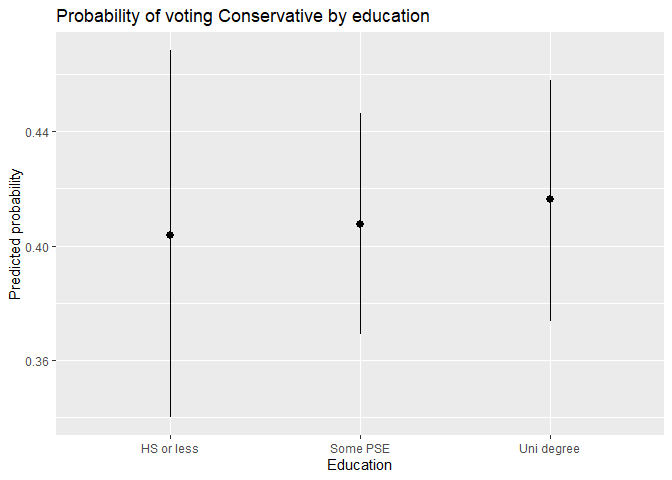
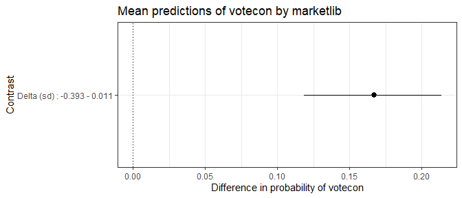
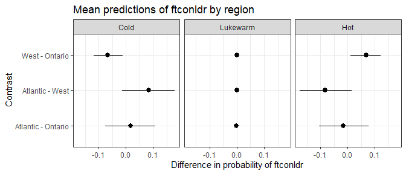
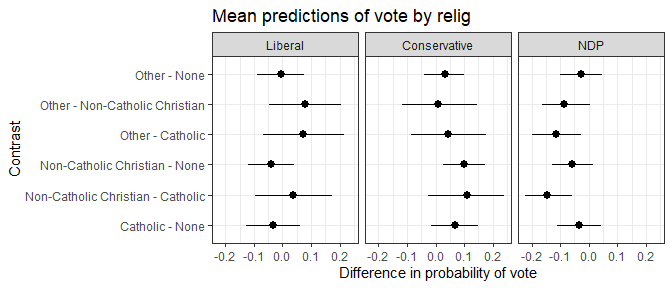

svyEffects
================

## Introduction

An oft-cited reason why `R` is not more widely used in social science
research is its disjointed and incomplete set of tools to deal with
weights. `{svyEffects}` helps address this problem by providing a suite
of post-estimation tools for working with limited dependent variable
models (binary, ordinal, and multinomial logit) estimated on
survey-weighted data.

Its main set of functions calculate predicted probabilities using
either:

-   the *average marginal effects* approach (also known as *marginal
    effects at observed values*, or *adjusted predictions*); or
-   the *marginal effects at reasonable/representative/typical values*
    approach (also known as *marginal effects for the average case*).

These approaches are analogous to Stata’s commands `margins x` and
`margins x, at`, respectively.

After calculating predicted probabilities, it will then calculate
differences in probabilities (also known as *contrasts*/*pairwise
comparisons* for categorical predictors or *first differences* for
continuous predictors) using:

-   for continuous predictors, the change across the entire range of the
    variable (by default), or a one-unit or one-standard-deviation
    change centred on the mean; or
-   for categorical predictors, all pairwise differences.

For both predictions and differences, it uses simulation methods (the
parametric bootstrap) to derive 95% confidence intervals.

It works with the following survey-weighted model objects:
`survey::svyglm` (binary logit), `survey::svyolr` (ordered logit),
`svrepmisc::svymultinom` (multinomial logit)

Eventually, support for (non-survey) weighted model objects (i.e. models
estimated with the `weight` option) will be added for `glm`,
`MASS::polr`, and `nnet::multinom`.

Also included in the package are:

-   A snippet of the 2019 Canadian Election Study online survey for
    testing and demonstration purposes. This can be loaded with the
    command `data(ces19)`.
-   A `plot()` method that creates a `ggplot` object of predicted
    probabilities or differences in predicted probabilities. This plot
    can be modified by adding further `ggplot` commands, which is shown
    below.
-   A function `mnlSig` that displays a concise summary of multinomial
    logit coefficients with statistical significance stars. This has
    been adapted for use on `svymultinom` objects from Dave Armstrong’s
    original function from `{DAMisc}`, which works for `multinom`
    objects.

------------------------------------------------------------------------

# Development history and differences from other packages

This package extends functions originally written by Dave Armstrong,
some of which are in his `{DAMisc}` package
(<https://github.com/davidaarmstrong/damisc>).

The reporting functions and naming conventions are inspired by Daniel
Ludecke’s excellent `{ggeffects}` package
(<https://github.com/strengejacke/ggeffects>). Current users of
`{ggeffects}` will notice similarities between `{svyEffects}` and
`{ggeffects}`. However, while `{ggeffects}` can estimate MER
probabilities (what it calls *adjusted predictions*) with `svyglm`
objects, it is not compatible with either `svyolr` or `svymultinom`
objects. Moreover, `{svyEffects}` estimates true average marginal
effects, which is the estimate of a variable’s effect on a given outcome
at the population level as opposed to a variable’s effect for a
hypothetical “average case” that may or may not exist or even be
theoretically plausible. (A detailed discussion of the difference is in
Hanmer and Kalkan 2013, *AJPS*, the full citation of which can be found
in the reference section.)

Note: because AMEs run simulations on multiple copies of your dataset,
they can take much more time to calculate than MERs, particularly on
large datasets or when using an older computer. Those needing quick
results can calculate MERs (which, in practice *usually* substantively
similar to AMEs) and then decide from there for which variables they
want to calculate AMEs.

------------------------------------------------------------------------

# Binary dependent variable models

To demonstrate how this function works with binary dependent variables,
we’ll model voting for the Conservative Party of Canada versus voting
for any other party.

``` r
data(ces19)

library(survey)
ces19_svy <- survey::svydesign(ids = ~1, strata = NULL, weights = ~pesweight, 
                                data = ces19, digits = 3)

VOTECON <- survey::svyglm(votecon ~ agegrp + gender + educ + region + relig + marketlib + culturetrad, 
                          design = ces19_svy, family = binomial)
summary(VOTECON)
#> 
#> Call:
#> svyglm(formula = votecon ~ agegrp + gender + educ + region + 
#>     relig + marketlib + culturetrad, design = ces19_svy, family = binomial)
#> 
#> Survey design:
#> survey::svydesign(ids = ~1, strata = NULL, weights = ~pesweight, 
#>     data = ces19, digits = 3)
#> 
#> Coefficients:
#>                             Estimate Std. Error t value Pr(>|t|)    
#> (Intercept)                 -0.72420    0.42951  -1.686  0.09202 .  
#> agegrp35-54                  0.18969    0.30665   0.619  0.53630    
#> agegrp55+                    0.37571    0.30225   1.243  0.21407    
#> genderWoman/Other           -0.35954    0.18701  -1.923  0.05476 .  
#> educSome PSE                 0.02885    0.24444   0.118  0.90605    
#> educUni degree               0.08152    0.26961   0.302  0.76244    
#> regionWest                   0.64625    0.19603   3.297  0.00101 ** 
#> regionAtlantic               0.32897    0.35624   0.923  0.35596    
#> religCatholic                0.45252    0.26196   1.727  0.08433 .  
#> religNon-Catholic Christian  0.65283    0.22961   2.843  0.00454 ** 
#> religOther                   0.75055    0.39610   1.895  0.05834 .  
#> marketlib                    2.28579    0.30268   7.552 8.16e-14 ***
#> culturetrad                  1.96134    0.23845   8.225 4.76e-16 ***
#> ---
#> Signif. codes:  0 '***' 0.001 '**' 0.01 '*' 0.05 '.' 0.1 ' ' 1
#> 
#> (Dispersion parameter for binomial family taken to be 0.9166063)
#> 
#> Number of Fisher Scoring iterations: 5
```

Let’s look at the effect of educational attainment (`educ`), a
categorical predictor with three levels: high school or less, some
post-secondary, and a university degree at the bachelor’s level or
higher.

The function `svyAME` will return average marginal effects for
education, or the effect of a change in education, holding all other
variables at observed values. We’ll specify a seed value for
reproducibility purposes.

The function’s output is a list that contains three data frames:

-   `$preds`: predicted probabilities
-   `$diffs`: differences in predicted probabilities
-   `$seed`: the seed value used for the simulations

``` r
library(svyEffects)
VOTECON_educ_ame <- svyEffects::svyAME(VOTECON,
                                       varname = "educ",
                                       weightvar = "pesweight",
                                       seed = 2019)
VOTECON_educ_ame$preds
#> # A tibble: 3 x 5
#>   educ       predicted conf.low conf.high type       
#>   <fct>          <dbl>    <dbl>     <dbl> <chr>      
#> 1 HS or less     0.404    0.342     0.472 Probability
#> 2 Some PSE       0.409    0.369     0.448 Probability
#> 3 Uni degree     0.417    0.372     0.457 Probability
VOTECON_educ_ame$diffs
#> # A tibble: 3 x 5
#>   educ                    predicted conf.low conf.high type      
#>   <chr>                       <dbl>    <dbl>     <dbl> <chr>     
#> 1 Some PSE - HS or less     0.00460  -0.0701    0.0763 Difference
#> 2 Uni degree - HS or less   0.0128   -0.0695    0.0925 Difference
#> 3 Uni degree - Some PSE     0.00815  -0.0532    0.0673 Difference
VOTECON_educ_ame$seed
#> [1] 2019
```

The outputs of this function lend themselves well to plotting using
`{ggplot2}`. As an example, let’s plot the predicted probabilities of
voting Conservative across levels of education.

``` r
library(ggplot2)
ggplot(VOTECON_educ_ame$preds) +
  aes(x = educ,
      y = predicted,
      ymin = conf.low,
      ymax = conf.high) +
  geom_pointrange() +
  labs(title = "Probability of voting Conservative by education",
       y = "Predicted probability",
       x = "Education")
```

<!-- -->

For convenience, `{svyEffects}` also includes a `plot()` method, which
uses the `{ggplot2}` engine to visualize either predicted probabilities
or differences in predicted probabilities.

By default, the predicted probabilities are plotted, as shown below.

``` r
plot(VOTECON_educ_ame)
```

<!-- -->

Note that labelling is minimal on the automatically-generated plots, but
you can add your own customization using `{ggplot2}`’s code conventions.

``` r
plot(VOTECON_educ_ame) +
  scale_y_continuous(labels = scales::percent) +
  labs(title = "My title",
       subtitle = "My subtitle",
       x = "My xvar label",
       y = "My yvar label",
       caption = "My caption") +
  theme_classic()
```

<!-- -->

You can also plot the differences in predicted probabilities between
levels of education by including the option `what = "diffs"` (or simply
`"diffs"`) in the `plot()` function call.

``` r
plot(VOTECON_educ_ame, "diffs")
```

<!-- -->

Now, let’s look at the effect of market liberalism, a continuous
predictor that ranges from -1 (minimal market liberalism, or the most
left-wing position) to +1 (maximal market liberalism, or the most
right-wing position).

Note that, because the function returns a first difference for
continuous predictors, the graph is not any more illuminating than the
summary statistic.

``` r
VOTECON_marketlib_ame <- svyAME(VOTECON,
                                varname = "marketlib",
                                weightvar = "pesweight",
                                seed = 2019)
VOTECON_marketlib_ame$preds
#> # A tibble: 11 x 5
#>    marketlib predicted conf.low conf.high type       
#>        <dbl>     <dbl>    <dbl>     <dbl> <chr>      
#>  1    -1         0.125   0.0738     0.187 Probability
#>  2    -0.8       0.171   0.117      0.227 Probability
#>  3    -0.6       0.230   0.180      0.281 Probability
#>  4    -0.4       0.300   0.258      0.340 Probability
#>  5    -0.2       0.379   0.347      0.412 Probability
#>  6     0         0.465   0.428      0.502 Probability
#>  7     0.200     0.551   0.500      0.604 Probability
#>  8     0.4       0.635   0.567      0.706 Probability
#>  9     0.6       0.708   0.624      0.784 Probability
#> 10     0.8       0.775   0.681      0.859 Probability
#> 11     1         0.831   0.733      0.912 Probability
VOTECON_marketlib_ame$diffs
#> # A tibble: 1 x 5
#>   marketlib              predicted conf.low conf.high type      
#>   <chr>                      <dbl>    <dbl>     <dbl> <chr>     
#> 1 Delta (range) : -1 - 1     0.705    0.558     0.826 Difference
VOTECON_marketlib_ame$seed
#> [1] 2019
plot(VOTECON_marketlib_ame)
```

<!-- -->

``` r
plot(VOTECON_marketlib_ame, "diffs")
```

<!-- -->

------------------------------------------------------------------------

# Ordinal dependent variable models

To demonstrate ordinal dependent variables, we’ll model feeling
thermometer ratings for the leader of the Conservative Party of Canada.
This variable usually ranges from 0 to 100. But, for this example, we’ll
used a binned ordinal measure of “cold” (0-39), “lukewarm” (40-59), and
“hot” (60-100).

``` r
data(ces19)

library(survey)
ces19_svy <- svydesign(ids = ~1, strata = NULL, weights = ~pesweight, 
                        data = ces19, digits = 3)

CONLDR <- svyolr(ftconldr ~ agegrp + gender + educ + region + relig + marketlib + culturetrad, 
                 design = ces19_svy)
summary(CONLDR)
#> Call:
#> svyolr(ftconldr ~ agegrp + gender + educ + region + relig + marketlib + 
#>     culturetrad, design = ces19_svy)
#> 
#> Coefficients:
#>                                   Value Std. Error    t value
#> agegrp35-54                  0.17796372  0.2665702  0.6676055
#> agegrp55+                    0.04601115  0.2686809  0.1712483
#> genderWoman/Other           -0.49866393  0.1707825 -2.9198766
#> educSome PSE                -0.20802018  0.2231985 -0.9319963
#> educUni degree              -0.10211120  0.2430419 -0.4201383
#> regionWest                   0.41572273  0.1792462  2.3192838
#> regionAtlantic              -0.09551799  0.2884670 -0.3311228
#> religCatholic                0.46488829  0.2245240  2.0705501
#> religNon-Catholic Christian  0.60848101  0.2202608  2.7625480
#> religOther                   0.79950865  0.3459580  2.3109994
#> marketlib                    1.96343442  0.2572774  7.6315846
#> culturetrad                  1.95794984  0.2263782  8.6490220
#> 
#> Intercepts:
#>               Value   Std. Error t value
#> Cold|Lukewarm -0.4716  0.3817    -1.2356
#> Lukewarm|Hot   0.1141  0.3704     0.3079
```

Here’s the effect of education on feelings towards the Conservative
Party leader.

``` r
CONLDR_region_ame <- svyAME(CONLDR,
                            varname = "region",
                            weightvar = "pesweight",
                            seed = 2019)
CONLDR_region_ame$preds
#> # A tibble: 9 x 6
#>   y        region   predicted conf.low conf.high type       
#>   <fct>    <fct>        <dbl>    <dbl>     <dbl> <chr>      
#> 1 Cold     Ontario     0.501    0.458      0.541 Probability
#> 2 Lukewarm Ontario     0.0952   0.0746     0.116 Probability
#> 3 Hot      Ontario     0.404    0.369      0.442 Probability
#> 4 Cold     West        0.434    0.394      0.476 Probability
#> 5 Lukewarm West        0.0946   0.0742     0.115 Probability
#> 6 Hot      West        0.471    0.427      0.512 Probability
#> 7 Cold     Atlantic    0.517    0.432      0.601 Probability
#> 8 Lukewarm Atlantic    0.0944   0.0741     0.114 Probability
#> 9 Hot      Atlantic    0.388    0.307      0.476 Probability
CONLDR_region_ame$diffs
#> # A tibble: 9 x 6
#>   y        region             predicted conf.low conf.high type      
#>   <fct>    <chr>                  <dbl>    <dbl>     <dbl> <chr>     
#> 1 Cold     West - Ontario     -0.0667   -0.119   -0.0112   Difference
#> 2 Lukewarm West - Ontario     -0.000599 -0.00226  0.000644 Difference
#> 3 Hot      West - Ontario      0.0673    0.0112   0.120    Difference
#> 4 Cold     Atlantic - Ontario  0.0168   -0.0762   0.108    Difference
#> 5 Lukewarm Atlantic - Ontario -0.000787 -0.00463  0.000677 Difference
#> 6 Hot      Atlantic - Ontario -0.0160   -0.105    0.0771   Difference
#> 7 Cold     Atlantic - West     0.0835   -0.0136   0.179    Difference
#> 8 Lukewarm Atlantic - West    -0.000187 -0.00413  0.00210  Difference
#> 9 Hot      Atlantic - West    -0.0833   -0.176    0.0139   Difference
plot(CONLDR_region_ame)
```

<!-- -->

``` r
plot(CONLDR_region_ame, "diffs")
```

<!-- -->

Here’s the effect of market liberalism.

``` r
CONLDR_marketlib_ame <- svyAME(CONLDR,
                            varname = "marketlib",
                            weightvar = "pesweight",
                            diffchange = "range",
                            seed = 2019)
CONLDR_marketlib_ame$preds
#> # A tibble: 33 x 6
#>    y        marketlib predicted conf.low conf.high type       
#>    <fct>        <dbl>     <dbl>    <dbl>     <dbl> <chr>      
#>  1 Cold          -1      0.756    0.682      0.825 Probability
#>  2 Lukewarm      -1      0.0781   0.0562     0.101 Probability
#>  3 Hot           -1      0.166    0.109      0.226 Probability
#>  4 Cold          -0.8    0.698    0.634      0.764 Probability
#>  5 Lukewarm      -0.8    0.0895   0.0687     0.111 Probability
#>  6 Hot           -0.8    0.213    0.156      0.267 Probability
#>  7 Cold          -0.6    0.627    0.574      0.680 Probability
#>  8 Lukewarm      -0.6    0.101    0.0781     0.123 Probability
#>  9 Hot           -0.6    0.272    0.226      0.321 Probability
#> 10 Cold          -0.4    0.555    0.514      0.594 Probability
#> # ... with 23 more rows
CONLDR_marketlib_ame$diffs
#> # A tibble: 3 x 6
#>   y        marketlib              predicted conf.low conf.high type      
#>   <fct>    <fct>                      <dbl>    <dbl>     <dbl> <chr>     
#> 1 Cold     Delta (range) : -1 - 1   -0.630   -0.720    -0.529  Difference
#> 2 Lukewarm Delta (range) : -1 - 1   -0.0139  -0.0451    0.0178 Difference
#> 3 Hot      Delta (range) : -1 - 1    0.644    0.539     0.741  Difference
plot(CONLDR_marketlib_ame)
```

<!-- -->

``` r
plot(CONLDR_marketlib_ame, "diffs")
```

<!-- -->

For ordinal and multinomial probabilities, the plot method follows the
conventions used by the `{ggeffects}` package (i.e. facetting by
response level). But, you can re-create the `Stata` default of
colour-coding the response level by writing your own `ggplot` command,
as shown below.

``` r
ggplot(CONLDR_marketlib_ame$preds) +
  aes(x = marketlib, y = predicted, ymin = conf.low, ymax = conf.high, colour = y, fill = y) +
  geom_line() +
  geom_ribbon(colour = "transparent", alpha = 0.2) +
  labs(title = "Effect of market liberalism on Conservative leader ratings",
       x = "Market liberalism (least to most)",
       y = "Predicted probability",
       fill = "Rating",
       colour = "Rating") +
  theme_bw()
```

<!-- -->

------------------------------------------------------------------------

# Multinomial dependent variable models

To demonstrate multinomial dependent variables, we’ll model vote choice
in the 2019 Canadian Federal Election. To keep things simple, we’ll
limit our analysis to the three major parties (the Liberals,
Conservatives, and New Democrats) and exclude the province of Quebec
(which has a different party system and patterns of vote choice).

There is no way to directly estimate a multinomial model with the
`{survey}` package in R. The package `{svyrepmisc}` generates an
approximation by turning the weighting scheme into replicate weights and
estimating the model with those. It uses the jackknife to calculate
variances.

We’ll go through this process step-by-step. First, we’ll import the
data, do some data cleaning, and then create our usual survey-design
object.

``` r
data(ces19)
library(survey)
ces19_svy <- svydesign(ids = ~1, strata = NULL, weights = ~pesweight, 
                        data = ces19, digits = 3)
```

Now, we’ll use the function `as.svrepdesign()` from `{survey}` to turn
our sampling weights into replicate weights with variances calculated
using the jackknife.

``` r
ces19_svy_r <- as.svrepdesign(ces19_svy, type = "JK1")
```

After our survey design object with replicate weights and jackknife
variances is created, we can use the function `svymultinom` from
`{svyrepmisc}` to run our vote choice model.

Note: use the option `trace = FALSE` in the `svymultinom()` function
call to suppress the reporting of each replication (similar to using the
option `quietly` in Stata).

Included with `{svyEffects}` the function `mnlSig`, which displays
coefficients from multinomial logit models and flags statistically
significant ones. `mnlSig` is adapted from Dave Armstrong’s original
function from his `{DAMisc}` package.

``` r
# remotes::install_github("carlganz/svrepmisc")
library(svrepmisc)

VOTE <- svymultinom(vote ~ agegrp + gender + educ + region + relig + marketlib + culturetrad, 
                    design = ces19_svy_r, trace = FALSE)
mnlSig(VOTE)
#>                             Conservative     NDP
#> (Intercept)                      -0.281  -0.764 
#> agegrp35-54                       0.075  -0.286 
#> agegrp55+                         0.052  -0.959*
#> genderWoman/Other                -0.267   0.266 
#> educSome PSE                      0.195   0.486 
#> educUni degree                    0.032  -0.166 
#> regionWest                        0.898*  0.751*
#> regionAtlantic                    0.334   0.017 
#> religCatholic                     0.418  -0.049 
#> religNon-Catholic Christian       0.581* -0.181 
#> religOther                        0.440  -1.083*
#> marketlib                         2.113* -0.516 
#> culturetrad                       1.990*  0.076
```

For our post-estimation command, we’ll need to specify a few more
options because `svymultinom` does not store them in its output. These
are:

-   `design`: the survey design object used to estimate the model; and
-   `modform`: the model formula used in the `svymultinom` call (in the
    form `modform = "y ~ x1 + x2 + x3"`).

Here’s the effect of education.

``` r
VOTE_relig_ame <- svyAME(
  VOTE,
  varname = "relig",
  weightvar = "pesweight",
  seed = 2019,
  design = ces19_svy_r,
  modform = "vote ~ agegrp + gender + educ + region + relig + marketlib + culturetrad")
VOTE_relig_ame$preds
#> # A tibble: 12 x 6
#>    y            relig                  predicted conf.low conf.high type       
#>    <fct>        <fct>                      <dbl>    <dbl>     <dbl> <chr>      
#>  1 Liberal      None                       0.401   0.341      0.463 Probability
#>  2 Conservative None                       0.346   0.292      0.403 Probability
#>  3 NDP          None                       0.254   0.207      0.303 Probability
#>  4 Liberal      Catholic                   0.366   0.301      0.438 Probability
#>  5 Conservative Catholic                   0.413   0.357      0.470 Probability
#>  6 NDP          Catholic                   0.221   0.169      0.282 Probability
#>  7 Liberal      Non-Catholic Christian     0.360   0.307      0.415 Probability
#>  8 Conservative Non-Catholic Christian     0.446   0.399      0.493 Probability
#>  9 NDP          Non-Catholic Christian     0.194   0.149      0.247 Probability
#> 10 Liberal      Other                      0.438   0.320      0.563 Probability
#> 11 Conservative Other                      0.456   0.334      0.578 Probability
#> 12 NDP          Other                      0.106   0.0513     0.182 Probability
VOTE_relig_ame$diffs
#> # A tibble: 18 x 6
#>    y            relig                         predicted conf.low conf.high type 
#>    <fct>        <chr>                             <dbl>    <dbl>     <dbl> <chr>
#>  1 Liberal      Catholic - None                -0.0341   -0.127    0.0602  Diff~
#>  2 Conservative Catholic - None                 0.0671   -0.0151   0.149   Diff~
#>  3 NDP          Catholic - None                -0.0329   -0.110    0.0429  Diff~
#>  4 Liberal      Non-Catholic Christian - None  -0.0405   -0.122    0.0402  Diff~
#>  5 Conservative Non-Catholic Christian - None   0.100     0.0244   0.173   Diff~
#>  6 NDP          Non-Catholic Christian - None  -0.0596   -0.129    0.0144  Diff~
#>  7 Liberal      Non-Catholic Christian - Cat~   0.0370   -0.0945   0.174   Diff~
#>  8 Conservative Non-Catholic Christian - Cat~   0.110    -0.0249   0.241   Diff~
#>  9 NDP          Non-Catholic Christian - Cat~  -0.147    -0.223   -0.0599  Diff~
#> 10 Liberal      Other - None                   -0.00631  -0.0901   0.0757  Diff~
#> 11 Conservative Other - None                    0.0330   -0.0396   0.0996  Diff~
#> 12 NDP          Other - None                   -0.0267   -0.0993   0.0459  Diff~
#> 13 Liberal      Other - Catholic                0.0711   -0.0694   0.217   Diff~
#> 14 Conservative Other - Catholic                0.0432   -0.0857   0.177   Diff~
#> 15 NDP          Other - Catholic               -0.114    -0.198   -0.0254  Diff~
#> 16 Liberal      Other - Non-Catholic Christi~   0.0775   -0.0481   0.206   Diff~
#> 17 Conservative Other - Non-Catholic Christi~   0.0102   -0.117    0.144   Diff~
#> 18 NDP          Other - Non-Catholic Christi~  -0.0876   -0.162    0.00427 Diff~
plot(VOTE_relig_ame)
```

<!-- -->

``` r
plot(VOTE_relig_ame, "diffs")
```

<!-- -->

Here’s the effect of market liberalism.

``` r
VOTE_marketlib_ame <- svyAME(
  VOTE,
  varname = "marketlib",
  weightvar = "pesweight",
  seed = 2019,
  diffchange = "range",
  design = ces19_svy_r,
  modform = "vote ~ agegrp + gender + educ + region + relig + marketlib + culturetrad")
VOTE_marketlib_ame$preds
#> # A tibble: 33 x 6
#>    y            marketlib predicted conf.low conf.high type       
#>    <fct>            <dbl>     <dbl>    <dbl>     <dbl> <chr>      
#>  1 Liberal           -1       0.500   0.408      0.595 Probability
#>  2 Conservative      -1       0.122   0.0754     0.186 Probability
#>  3 NDP               -1       0.378   0.281      0.480 Probability
#>  4 Liberal           -0.8     0.491   0.420      0.565 Probability
#>  5 Conservative      -0.8     0.170   0.120      0.232 Probability
#>  6 NDP               -0.8     0.339   0.269      0.414 Probability
#>  7 Liberal           -0.6     0.472   0.420      0.528 Probability
#>  8 Conservative      -0.6     0.229   0.181      0.282 Probability
#>  9 NDP               -0.6     0.298   0.249      0.353 Probability
#> 10 Liberal           -0.4     0.444   0.402      0.486 Probability
#> # ... with 23 more rows
VOTE_marketlib_ame$diffs
#> # A tibble: 3 x 6
#>   y            marketlib              predicted conf.low conf.high type      
#>   <fct>        <chr>                      <dbl>    <dbl>     <dbl> <chr>     
#> 1 Liberal      Delta (range) : -1 - 1    -0.380   -0.494    -0.258 Difference
#> 2 Conservative Delta (range) : -1 - 1     0.256    0.123     0.389 Difference
#> 3 NDP          Delta (range) : -1 - 1    -0.243   -0.365    -0.124 Difference
plot(VOTE_marketlib_ame)
```

<!-- -->

``` r
plot(VOTE_marketlib_ame, "diffs")
```

<!-- -->

------------------------------------------------------------------------

# Marginal effects at reasonable values

*(documentation in progress)*

You can choose to calculate marginal effects at reasonable values (MER)
probabilities and differences by using the `svyMER` function, which
follows the same arguments as `svyAME`. This command would give you the
estimated effect of a variable “for the ‘typical’ case” (which may or
may not be typical, plausible, or even possible in the real world) as
opposed to the effect of a variable across the population (see Hanmer
and Kalkan 2013 for an in-depth discussion).

MER probabilities are *usually* very similar to AME probabilities, but
not always. However, they are *much* faster to calculate using
simulation methods.

------------------------------------------------------------------------

# Interaction effects

*(documentation in progress)*

Both `svyAME` and `svyMER` support calculating predicted probabilities
of combinations of two predictor variables. This can be done by using
the argument `byvar = "x"` in the function call.

This will not return differences in predicted probabilities. For
limited-dependent variable models, one would need to calculate a second
difference would be needed to test for the significance of an
interaction between two variables, either from the inclusion of a
product term or through the compression inherent in these types of
models (see Norton, Wang, and Ai 2004).

Dave Armstrong’s `{DAMisc}` package has an `R` port for Norton, Wang,
and Ai’s original `Stata` function, and this will eventually be ported
to `{svyEffects}` for use in survey-weighted models.

------------------------------------------------------------------------

# Planned updates

This package is under active development, and updates will include:

1.  More user-friendly error-checking and reporting (e.g. checking at
    the beginning of the function that the variables in the function
    don’t have typos).
2.  Support for (non-survey) weighted models and weighted models. While
    there are other packages that do this, some do not return confidence
    intervals for predictions for some model types. And, to my
    knowledge, none use simulation methods to derive confidence
    intervals. *Note: You can actually already do this with
    `{svyEffects}` by creating a survey design object with a weight of
    “1”, but it would be good to avoid having to use that workaround.*
3.  In-depth comparisons with Stata results.
4.  Functions for calculating weighted model fit measures.
5.  Support for using an alternative variance-covariance matrix using
    `{sandwich}`. This would only be for binary logit models because
    `{sandwich}` does not play nice with ordinal or multinomial models.
    That said, survey-weighted models do adjust the variance-covariance
    matrix (the documentation for `{survey}` does not specify the
    correction method it uses, but it appears to be HC0, based on what
    I’ve seen).
6.  A second differences function to test for the significance of a
    two-way interaction.
7.  (Eventually) Use of the delta method to calculate confidence
    intervals for AMEs probabilities to speed up computational time.

------------------------------------------------------------------------

# References

Armstrong, Dave. 2022. *DAMisc: Dave Armstrong’s Miscellaneous
Functions.* R package version 1.7.2.

Hanmer, M.J. and K.O. Kalkan. 2013. “Behind the Curve: Clarifying the
Best Approach to Calculating Predicted Probabilities and Marginal
Effects from Limited Dependent Variable Models.” *American Journal of
Political Science*. 57(1): 263-277.

Norton, Edward C., Hua Wang and Chunrong Ai. 2004. Computing Interaction
Effects and Standard Errors in Logit and Probit Models. *The Stata
Journal* 4(2): 154-167.

Rainey, Carlisle. 2016. “Compression and Conditional Effects: A Product
Term Is Essential When Using Logistic Regression to Test for
Interaction.” *Political Science Research and Methods* 4(3): 621-639.

Stephenson, Laura B; Harell, Allison; Rubenson, Daniel; Loewen, Peter
John, 2020, “2019 Canadian Election Study - Online Survey,”
<https://doi.org/10.7910/DVN/DUS88V>, Harvard Dataverse, V1.
